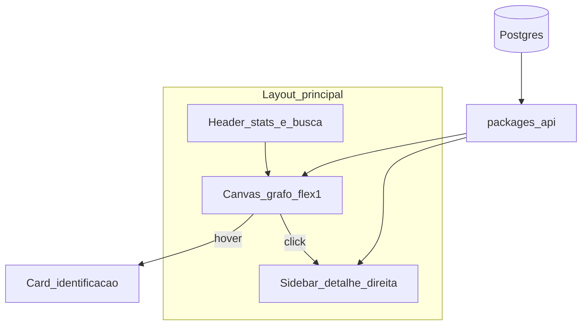
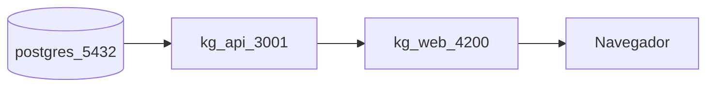
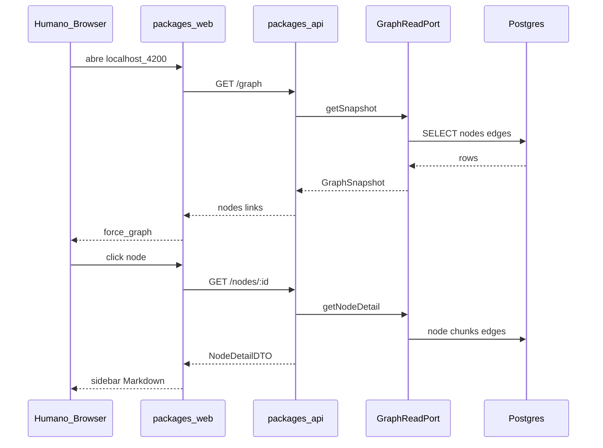
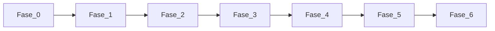

# Plano de execução — Graph Explorer (UI humana)

## Contexto e escopo

A POC backend ([poc_knowledge_graph_d173250f.plan.md](./poc_knowledge_graph_d173250f.plan.md)) está concluída: Postgres com `nodes`/`edges`, ingest, MCP para IAs. Este plano adiciona uma **ferramenta web só para humanos** — exploração visual do grafo, **sem** expor MCP nem fluxos de Context Pack.

Referências de domínio:

- Ontologia implementada: [packages/core/src/graph/ontology.ts](packages/core/src/graph/ontology.ts) — tipos `Document`, `Section`, `Chunk`, GTM (`Product`, `ICP`, `Competitor`, …) e arestas `contains`, `linksTo`, `mentions`, `competesWith`, etc.
- Docs conceituais: [docs/04-ontologia-grafo.md](docs/04-ontologia-grafo.md)
- Escala atual (corpus NexusFlow): ~31 documentos, ~125 nós, ~233 arestas — adequada para grafo completo com filtros + expansão sob demanda

**Fora deste plano (explícito):** edição do grafo, ingest pela UI, autenticação multi-tenant, 3D/WebGL pesado, substituir Neo4j, integração com agentes/LLM.

**Nota:** [docs/08-plano-poc.md](docs/08-plano-poc.md) listava “UI administrativa do grafo” como fora do escopo da POC original; este plano cobre essa evolução como iniciativa separada.

---

## Decisão de stack: **Angular 19.2.0 + API Fastify read-only**

| Critério | Escolha | Alternativa descartada |
|----------|---------|------------------------|
| UI framework | **Angular 19.2.0** (pin exato em `package.json`) + **Angular CLI 19.2.x** | React + Vite — fora do escopo por decisão do projeto |
| Build / dev server | **`@angular/build:application`** (esbuild) via `ng serve` / `ng build` | Vite — não se aplica a Angular |
| Grafo (force-directed) | **`ForceGraphComponent`** — wrapper Angular sobre **`force-graph`** (mesmo motor d3-force do ecossistema GitNexus/react-force-graph) | `react-force-graph-2d` — depende de React; **ngx-graph** reserva se wrapper vanilla falhar customização de `nodeVal`/cores |
| Estilo / layout | **Angular Material 19** (`mat-sidenav` = sidebar, `mat-dialog` = hover, `mat-expansion-panel`, `mat-chips`) + SCSS por componente | shadcn/ui — ecossistema React |
| Estado / HTTP | **Signals** + `HttpClient` + services (`GraphExplorerService`, `NodeDetailService`) | NgRx — overkill para POC |
| Markdown | **`ngx-markdown`** (ou `marked` + `DomSanitizer`) | `react-markdown` |
| API | **`packages/api`** — **Fastify 5** + **Zod** (contratos em `@kg/core`) | Reutilizar MCP — MCP é canal para IAs, não HTTP para humanos |
| Padrão | **Hexagonal** — ports em `core`; adapter Postgres; API e Angular app como driving adapters | SQL e regras de negócio nos components |

**Versões obrigatórias (pin):**

```json
{
  "@angular/core": "19.2.0",
  "@angular/cli": "19.2.0",
  "@angular/common": "19.2.0",
  "@angular/compiler": "19.2.0",
  "@angular/platform-browser": "19.2.0",
  "@angular/material": "^19.2.0"
}
```

**Conclusão:** o monorepo pnpm ganha `packages/api` e `packages/web` (app Angular standalone), mais [docs/10-explorador-grafo.md](docs/10-explorador-grafo.md). Reutiliza `DATABASE_URL` e o pool Postgres existente.

---

## Modelo visual (requisitos)



| Elemento | Regra |
|----------|--------|
| **Tamanho do nó** | `val = sqrt(degree + 1) * k`, `degree = in + out`; bônus `+2` no grau efetivo se `node_type === Document` |
| **Cor do nó** | Paleta fixa por `node_type` em `graph-theme.ts` |
| **Cor da aresta** | Paleta por `edge_type`; `mentions` pode usar traço tracejado no canvas |
| **Espessura da aresta** | `1 + log(1 + weight)` com weight default 1 |
| **Hover** | Card: `label`, `node_type`, `node_id`, props cruciais (`path`, `doc_type`, `name`) |
| **Clique** | **`mat-sidenav`** lateral (~400–480px, `mode="over"`): conteúdo completo por tipo de nó |
| **Legenda** | Canto inferior — cores de nó e aresta |

**Performance:** snapshot default `maxNodes=300`, `maxEdges=600`; acima disso, API devolve subgrafo por `seed` + `hops` ou filtros.

**Filtro default na UI:** ocultar `Chunk` e `Section` (grafo “semântico”); toggle “Mostrar estrutura P0”.

---

## Detalhe do nó (sidebar)

| `node_type` | Conteúdo na sidebar |
|-------------|---------------------|
| `Document` | Metadados + sections/chunks em accordion; Markdown renderizado |
| `Section` / `Chunk` | Heading, ids, texto integral, link para documento pai |
| GTM | `properties` + chunks citados (arestas `mentions` incoming) + doc de origem |
| Qualquer | Lista de arestas incidentes clicáveis → foca vizinho no grafo |

Render: `ngx-markdown` (ou `marked` com sanitização Angular); **sem** HTML raw não sanitizado (evitar XSS).

---

## API REST (contratos alvo)

Base dev: `http://localhost:3001/api/v1`. **Somente leitura.**

| Método | Rota | Descrição |
|--------|------|-----------|
| `GET` | `/health` | `{ ok: true }` |
| `GET` | `/stats` | Mesmo shape que `kg_stats` |
| `GET` | `/graph` | Query: `seed?`, `hops?` (0–2), `nodeTypes[]`, `docType?`, `limit?` → `{ nodes[], links[] }` |
| `GET` | `/nodes/:nodeId` | Detalhe + `incidentEdges` + `relatedChunks` |
| `GET` | `/search` | Query: `q` → nós por `label` / `properties.path` |

**DTO de visualização:**

```ts
interface GraphNodeDTO {
  id: string;
  label: string;
  type: string;
  val: number;
  color?: string;
  x?: number;
  y?: number;
}
interface GraphLinkDTO {
  source: string;
  target: string;
  type: string;
  color?: string;
}
```

Schemas Zod em `packages/core/src/explorer/` (exportados por `@kg/core`).

---

## Estrutura do repositório (delta)

```text
knowledge-graph-poc/
  packages/
    core/
      src/ports/graph-read.ts
      src/explorer/graph-theme.ts
      src/explorer/schemas.ts
    adapter-postgres/
      src/repositories/graph-read-repository.ts
    api/
      src/server.ts
      src/routes/graph.ts
      src/routes/nodes.ts
      src/routes/stats.ts
    web/                              # Angular 19.2.0 application
      angular.json
      src/
        app/
          app.config.ts
          app.routes.ts
          app.component.ts
          core/
            services/graph-explorer.service.ts
            services/node-detail.service.ts
          features/
            graph-explorer/
              graph-explorer.component.ts
              graph-canvas/
                force-graph.component.ts    # wrapper force-graph
              graph-filters/
                graph-filters.component.ts
              graph-legend/
                graph-legend.component.ts
              node-hover-dialog/
                node-hover-dialog.component.ts
              node-detail-sidenav/
                node-detail-sidenav.component.ts
        environments/
          environment.ts                  # apiUrl
          environment.development.ts
  docs/
    10-explorador-grafo.md
  docker/
    docker-compose.dev.yml    # profile explorer: kg-api, kg-web
```

**Scripts npm alvo:**

| Script | Ação |
|--------|------|
| `pnpm explorer:api` | Fastify com `--env-file=.env` |
| `pnpm explorer:web` | `ng serve` em `packages/web` (proxy `/api` → 3001 via `angular.json`) |
| `pnpm explorer:build` | `ng build` production |
| `pnpm explorer:up` | Postgres + profile explorer |
| `pnpm test:explorer` | unit API (Vitest) + Angular unit (Karma/Jasmine ou Vitest Angular) + Playwright smoke |

---

## Docker (dev)



| Serviço | Porta | Profile |
|---------|-------|---------|
| `postgres` | 5432 | default |
| `kg-api` | 3001 | `explorer` |
| `kg-web` | **4200** | `explorer` (`ng serve --host 0.0.0.0`) |

---

## Fase 0 — Fundação explorer

**Entregáveis:** pacotes `api` + `web`, [docs/10-explorador-grafo.md](docs/10-explorador-grafo.md), profile `explorer`, env vars.

| # | Tarefa | Testes |
|---|--------|--------|
| 0.1 | Criar `packages/api` (Fastify) | `pnpm build` |
| 0.2 | Criar `packages/web` com **`ng new` Angular 19.2.0** — standalone, SCSS, routing, **sem** SSR | `ng version` = 19.2.x |
| 0.3 | Pin `@angular/*` **19.2.0**; adicionar Angular Material 19 | `ng build` |
| 0.4 | Proxy dev em `angular.json`: `/api` → `http://localhost:3001` | smoke `ng serve` |
| 0.5 | `docker-compose.dev.yml` — `kg-api`, `kg-web` (profile `explorer`, porta 4200) | compose healthy |
| 0.6 | `.env.example`: `API_PORT`, `GRAPH_MAX_*`; `environment.ts` com `apiUrl` | — |
| 0.7 | Documentar stack Angular em `docs/10-explorador-grafo.md` | revisão |

---

## Fase 1 — Ports e queries Postgres

Reutilizar padrão CTE de [graph-expansion-repository.ts](packages/adapter-postgres/src/repositories/graph-expansion-repository.ts).

| # | Tarefa | Testes |
|---|--------|--------|
| 1.1 | Port `GraphReadPort.getSnapshot(filters)` | unit: mock |
| 1.2 | Port `NodeDetailPort.getById(nodeId)` | unit: mock |
| 1.3 | `PostgresGraphReadRepository` — snapshot + detalhe com JOINs `documents`/`chunks` | integration: corpus |
| 1.4 | Cálculo `val` (grau + bônus Document) no adapter | unit: fórmula |
| 1.5 | `searchNodes(q, limit)` — ILIKE `label` e `properties->>'path'` | integration |

---

## Fase 2 — API HTTP

| # | Tarefa | Testes |
|---|--------|--------|
| 2.1 | Fastify + `@fastify/cors` (origem `http://localhost:4200`) | — |
| 2.2 | Rotas `/health`, `/stats`, `/graph`, `/nodes/:id`, `/search` | integration: inject/supertest |
| 2.3 | Validação query Zod (`hops` 0–2, `limit` ≤ 500) | unit: 400 inválido |
| 2.4 | Erros JSON padronizados `{ error, code }` | unit |
| 2.5 | `pnpm explorer:api` | curl smoke |

---

## Fase 3 — Shell UI Angular (layout GitNexus-like)

| # | Tarefa | Testes |
|---|--------|--------|
| 3.1 | `GraphExplorerComponent` — layout Material: toolbar (stats), canvas `flex-1`, `mat-sidenav` à direita | `TestBed` + `ComponentFixture` |
| 3.2 | `GraphExplorerService` — `HttpClient` → `/graph`, signals `loading`/`error`/`graphData` | unit: `HttpClientTestingModule` |
| 3.3 | `GraphFiltersComponent` — `mat-chip-listbox` / checkboxes por `node_type`, `doc_type`, botão Recarregar | unit |
| 3.4 | Busca na toolbar → `/search` → emite `focusNodeId` para o canvas | Playwright smoke |
| 3.5 | Importar `BrowserAnimationsModule`; tema Material custom (CSS variables alinhadas a `graph-theme.ts`) | — |

---

## Fase 4 — Canvas force-graph (estética)

| # | Tarefa | Testes |
|---|--------|--------|
| 4.1 | `ForceGraphComponent` — `AfterViewInit`: instanciar `ForceGraph` (pacote `force-graph`) no container; `@Input() graphData` | unit: mock `graphData` |
| 4.2 | `nodeVal(d)` ← `d.val` do DTO; `nodeColor` / `linkColor` importados de `@kg/core` `graph-theme` | unit: cores por tipo |
| 4.3 | `onNodeHover` / `onNodeClick` → `@Output()` para o container | unit |
| 4.4 | Setas direcionais (`linkDirectionalArrowLength`); `linkLineDash` para `mentions` | visual QA |
| 4.5 | `nodeLabel` truncado; zoom para exibir labels | — |
| 4.6 | `GraphLegendComponent` — lista estática tipo → cor | snapshot |
| 4.7 | Toolbar canvas: pause/resume simulation, reset zoom (`zoomToFit`) | — |
| 4.8 | (Fallback) Se wrapper `force-graph` bloquear: migrar para `@swimlane/ngx-graph` com `nodeTemplate` custom | spike documentado em Fase 0 |

---

## Fase 5 — Interações

| # | Tarefa | Testes |
|---|--------|--------|
| 5.1 | Hover → `NodeHoverDialogComponent` (`MatDialog` ou overlay posicionado no cursor) com props cruciais | unit |
| 5.2 | Click → abre `mat-sidenav` + `NodeDetailService.getById()` | Playwright |
| 5.3 | Links “Ir para nó” na sidenav → `ForceGraphComponent.centerAt(id)` via `@ViewChild` | Playwright |
| 5.4 | Botão “Expandir vizinhos” → merge subgraph (`/graph?seed=&hops=1`) no signal `graphData` | integration + manual |
| 5.5 | ESC / backdrop fecha sidenav; seleção mantida no grafo | unit |
| 5.6 | Markdown no detalhe via `ngx-markdown` | snapshot |

---

## Fase 6 — QA, CI e operação

| # | Tarefa | Testes |
|---|--------|--------|
| 6.1 | README — seção Graph Explorer, screenshots | — |
| 6.2 | CI job `explorer` — build + API integration + Playwright | GitHub Actions |
| 6.3 | Cobertura ≥80% `packages/api` (Vitest); ≥70% services + components críticos em `web` (Jasmine ou Vitest Angular) | coverage report |
| 6.4 | Atualizar [docs/08-plano-poc.md](docs/08-plano-poc.md) — UI explorador referenciada | — |
| 6.5 | Checklist manual: cores por tipo; clique `Competitor` mostra menções | QA doc |

---

## Fluxo de dados



---

## Paleta inicial (`graph-theme.ts`)

**Nós:**

| `node_type` | Cor |
|-------------|-----|
| `Document` | `#3b82f6` |
| `Section` | `#93c5fd` |
| `Chunk` | `#cbd5e1` |
| `Product` | `#8b5cf6` |
| `Competitor` | `#ef4444` |
| `Persona` / `ICP` | `#f59e0b` |
| `Feature` | `#10b981` |
| default GTM | `#64748b` |

**Arestas:**

| `edge_type` | Cor | Notas |
|-------------|-----|-------|
| `contains` | `#94a3b8` | fino |
| `linksTo` | `#2563eb` | navegação |
| `mentions` | `#a855f7` | tracejado |
| `competesWith` | `#dc2626` | grosso |
| `targetsICP` | `#d97706` | — |
| default GTM | `#64748b` | — |

---

## Variáveis de ambiente (novas)

| Variável | Default | Uso |
|----------|---------|-----|
| `API_PORT` | `3001` | bind Fastify |
| `NG_APP_API_URL` | `http://localhost:3001/api/v1` | injetado em `environment.ts` (build Angular); em Docker passar como env no `ng build` |
| `GRAPH_MAX_NODES` | `300` | cap snapshot |
| `GRAPH_MAX_EDGES` | `600` | cap snapshot |
| `DATABASE_URL` | (existente) | pool Postgres |

---

## Ordem de execução



Fase 3 pode usar **mock JSON** até Fase 2 pronta; aceite final exige API + corpus ingerido.

---

## Riscos e mitigações

| Risco | Mitigação |
|-------|-----------|
| Grafo poluído com Chunks | Filtro default oculta estrutura P0 |
| Canvas lento >500 nós | Limits na API; expansão incremental |
| CORS / URL em Docker | `environment.ts` + proxy `angular.json` em dev |
| XSS em Markdown | `ngx-markdown` sanitizado / bypassSecurityTrustHtml proibido |
| Duplicar MCP | ports em `@kg/core`; Angular não chama MCP |
| Zone.js + force-graph performance | `NgZone.runOutsideAngular` na simulação d3; reentrar zone só em hover/click |
| Pin Angular drift | `pnpm overrides` ou `resolutions` travando `@angular/core@19.2.0` |

---

## Métricas de aceite

| Métrica | Meta |
|---------|------|
| Grafo visível após `explorer:up` | < 3s (corpus já ingerido) |
| Clique → sidebar com conteúdo | 100% tipos no corpus |
| Distinção `competesWith` vs `linksTo` | legível (cor + legenda) |
| CI | API integration + 1 Playwright verde |

---

## Execução sugerida

Após aprovação: orquestração por **subagents** (uma fase por agente; paralelizar Fase 3 com mock + Fase 1 quando contratos Zod estiverem fixos). Não alterar [poc_knowledge_graph_d173250f.plan.md](./poc_knowledge_graph_d173250f.plan.md).

**Aprova o plano?** (responda: aprovar / pedir alteração / recusar)
