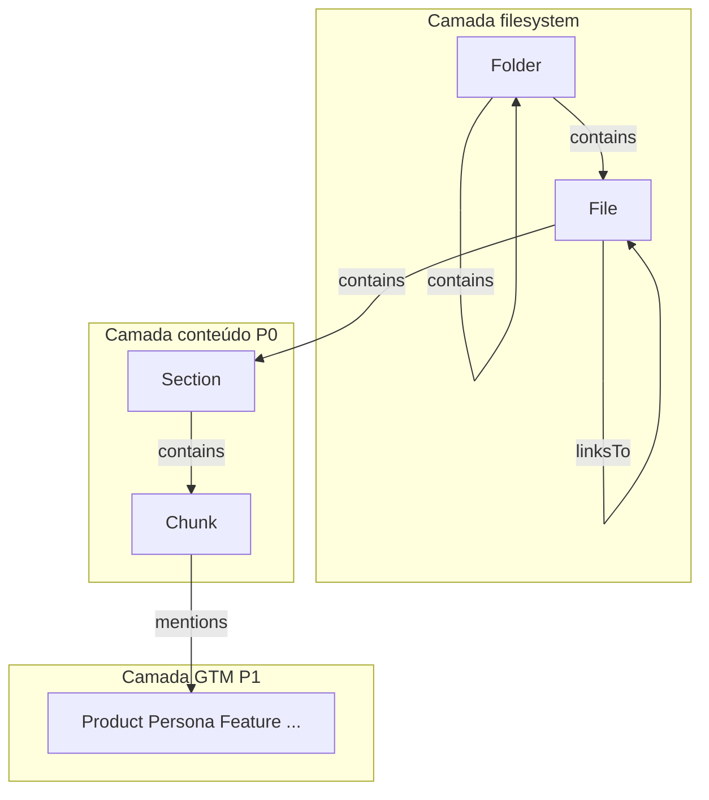
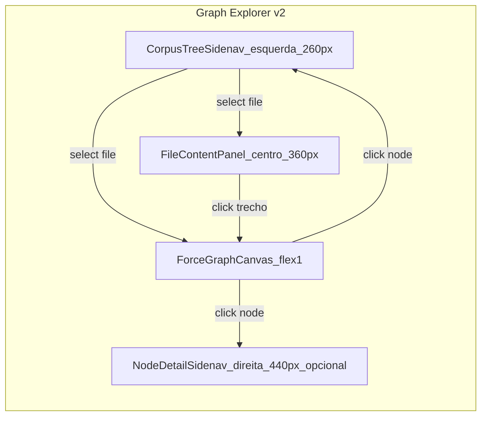
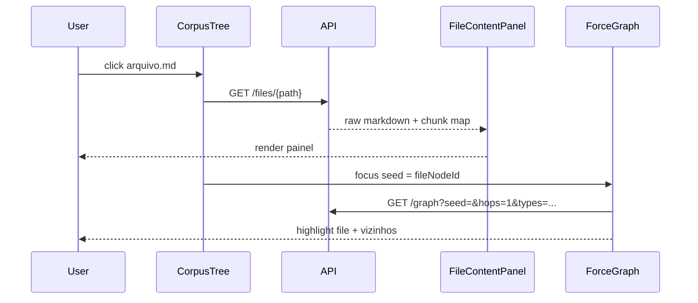
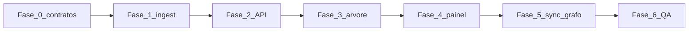

# Plano — Graph Explorer: navegação por corpus (estilo GitNexus / Cursor)

## Status do trabalho anterior

As fases **0–6** do plano original (API read-only, canvas force-graph, hover, sidenav detalhe, tema dark, Playwright) estão **implementadas** no repositório. Este documento **substitui o escopo futuro** do explorer e define a próxima entrega.

**Não alterar:** [poc_knowledge_graph_d173250f.plan.md](./poc_knowledge_graph_d173250f.plan.md)

---

## Objetivo (resumo)

Replicar o fluxo do **GitNexus** / **Explorer do VS Code**:

| Ação do usuário | Comportamento esperado |
|-----------------|------------------------|
| Navegar pastas/arquivos na **barra esquerda** | Árvore do corpus (`corpus/…`), expandir/colapsar, ícones pasta/arquivo |
| Clicar em **arquivo** | (1) Abre **painel de conteúdo** com o Markdown exato do arquivo; (2) **Destaca no grafo** o nó do arquivo e vizinhança (contains, linksTo, mentions relevantes) |
| Clicar em **trecho** do arquivo (heading, parágrafo, bloco) | Destaca o nó **`Chunk`** (ou `Section` se aplicável) — **não** o nó de arquivo |
| Clicar nó no grafo (File/Chunk/GTM) | Sincroniza seleção na árvore e/ou painel de conteúdo quando for estrutural |

---

## Modelo de nós (lapidação da ontologia)

### Camadas

### Tipos de nó

| Tipo | Papel | Relação com hoje | Propriedades chave |
|------|--------|------------------|-------------------|
| **`Folder`** | Diretório no corpus | **Novo** | `path` (dir relativo), `name` |
| **`File`** | Arquivo `.md` ingerido | Substitui alias de `Document` | `path`, `doc_type`, `title`, `content_hash` |
| **`Section`** | Bloco sob heading | Mantém | `heading`, `level`, `ordinal` |
| **`Chunk`** | Unidade de indexação / trecho | Mantém + **âncoras** | `heading`, `text`, `start_line`, `end_line`, `path` |
| **GTM** (`Product`, …) | Entidades de negócio | Mantém | como hoje |

### Migração `Document` → `File`

| Estratégia | Prós | Contras |
|----------|------|---------|
| **A — Renomear tipo** (`node_type = 'File'`) | Modelo limpo | Breaking change em queries/MCP; migration SQL |
| **B — Dual label** (ingest grava `File`, UI aceita `Document`) | Transição suave | Dívida técnica curta |
| **Recomendado:** **A** com migration `UPDATE nodes SET node_type = 'File' WHERE node_type = 'Document'` + atualizar ontologia, ingest, theme, filtros | Alinhado ao pedido do usuário | Uma PR de migração |

`STRUCTURAL_NODE_TYPES` passa a: `["Folder", "File", "Section", "Chunk"]`.

### Arestas

| Aresta | Uso |
|--------|-----|
| `contains` | `Folder→Folder`, `Folder→File`, `File→Section`, `Section→Chunk` |
| `linksTo` | `File→File` (wikilinks) |
| `mentions` | `Chunk→GTM` |
| GTM | inalterado |

---

## Layout da UI (alvo)

| Região | Componente Angular | Comportamento |
|--------|-------------------|---------------|
| **Esquerda** | `CorpusTreeComponent` | `mat-tree` ou lista aninhada; raiz = `corpus/`; ícone pasta/arquivo; busca rápida opcional |
| **Centro** (novo) | `FileContentPanelComponent` | Markdown fonte ou preview; blocos por Section/Chunk com `data-chunk-id`; scroll sync |
| **Centro-direita** | `ForceGraphComponent` (existente) | Grafo; highlight ego-network; dim em hover (já implementado) |
| **Direita** | `NodeDetailSidenavComponent` (existente) | Metadados + chunks GTM; abre em nó GTM ou duplo painel |

**Filtros:** mover para drawer colapsável ou toolbar — a árvore ocupa o lugar dos filtros atuais à esquerda; filtros de `node_type` permanecem acessíveis (chips na toolbar).

---

## Fluxos de interação

### 1. Seleção de arquivo na árvore

### 2. Clique em trecho → nó Chunk

1. Ingest persiste `start_line` / `end_line` por chunk (calculado no `chunkDocument` a partir do body acumulado).
2. Painel renderiza com spans ou blocos `id="chunk-{chunkId}"`.
3. `click` / `selectionchange` resolve `chunkId` → `GraphExplorerService.focusNode(chunkId)` + highlight só Chunk + arestas incidentes.
4. Árvore **não** muda de arquivo (já está no arquivo correto).

### 3. Clique no grafo → árvore

- Nó `File` / `Folder`: expandir path na árvore e carregar painel se `File`.
- Nó `Chunk`: abrir arquivo pai na árvore + painel + scroll até bloco do chunk.
- Nó GTM: sidenav direita (comportamento atual) + opcionalmente não alterar painel central.

---

## API REST (delta)

Base: `http://localhost:3001/api/v1`

| Método | Rota | Descrição |
|--------|------|-----------|
| `GET` | `/corpus/tree` | Árvore `{ name, path, kind: 'folder'\|'file', children?, nodeId? }` derivada de `KG_WORKSPACE` + nós `Folder`/`File` |
| `GET` | `/files/*path` | Conteúdo bruto do `.md` + `{ docId, fileNodeId, chunks: [{ chunkId, sectionId, heading, startLine, endLine }] }` |
| `GET` | `/graph` | (existente) + query `highlightMode=ego&seed=` otimizado para seleção arquivo/chunk |
| `GET` | `/nodes/:id` | (existente) + para `Chunk` incluir `parentFilePath`, `lineRange` |

**Segurança:** paths normalizados; rejeitar `..`; só leitura sob `corpus/`.

---

## Fase 0 — Contratos e decisões

| # | Tarefa | Saída |
|---|--------|-------|
| 0.1 | Atualizar [ontology.ts](packages/core/src/graph/ontology.ts): `Folder`, `File`; deprecar `Document` | PR design |
| 0.2 | Zod schemas: `CorpusTreeNode`, `FileContentDTO`, `ChunkAnchorDTO` em `packages/core/src/explorer/` | tipos exportados |
| 0.3 | Port `CorpusReadPort` (tree, fileByPath, chunksByDocId) | interface em `core/ports` |
| 0.4 | ADR curto em [docs/10-explorador-grafo.md](docs/10-explorador-grafo.md) — seção “Navegação corpus” | doc |

**Testes:** unit Zod; validação paths.

---

## Fase 1 — Ingest e Postgres

| # | Tarefa | Detalhe |
|---|--------|---------|
| 1.1 | Durante `walkMarkdownFiles`, criar nós `Folder` por segmento de path | `contains` pai→filho |
| 1.2 | Nó `File` por `.md` (substituir `Document`) | `edge` Folder→File |
| 1.3 | Manter Section/Chunk; `File→Section→Chunk` | contains |
| 1.4 | Calcular `start_line`/`end_line` no chunker | propriedades no nó Chunk |
| 1.5 | Migration SQL + re-ingest corpus | script documentado |

**Testes:** integration ingest — contagens Folder/File; proveniência linha; `pnpm kg ingest` idempotente.

---

## Fase 2 — API

| # | Tarefa |
|---|--------|
| 2.1 | `PostgresCorpusReadRepository` |
| 2.2 | Rotas `/corpus/tree`, `/files/*` |
| 2.3 | Estender `/graph` com preset `fileNeighborhood` / `chunkNeighborhood` |
| 2.4 | Testes supertest + integration |

---

## Fase 3 — UI: árvore de corpus

| # | Tarefa |
|---|--------|
| 3.1 | `CorpusTreeComponent` — `HttpClient` → `/corpus/tree` |
| 3.2 | Layout: `mat-sidenav` esquerda fixa (~260px), tema dark |
| 3.3 | Seleção single-file; emit `fileSelected(path, nodeId)` |
| 3.4 | Ícones Material `folder` / `description` |
| 3.5 | Playwright: árvore visível, click arquivo dispara request `/files/` |

---

## Fase 4 — UI: painel de conteúdo

| # | Tarefa |
|---|--------|
| 4.1 | `FileContentPanelComponent` — markdown monospace ou preview ngx-markdown |
| 4.2 | Decorar blocos com `data-chunk-id` a partir de anchors |
| 4.3 | `click` em bloco → `focusNode(chunkId)` + classe `.chunk-selected` |
| 4.4 | Scroll into view quando foco vem do grafo |
| 4.5 | Playwright: após abrir arquivo, click bloco → tooltip/grafo não some (regressão hover) |

---

## Fase 5 — Sincronização grafo

| # | Tarefa |
|---|--------|
| 5.1 | `selectFile(nodeId)` → subgraph seed File, hops=1, edgeTypes filtrados |
| 5.2 | `selectChunk(nodeId)` → highlight Chunk + Section pai + File; dim demais |
| 5.3 | Click grafo em File/Chunk → sync tree + panel |
| 5.4 | Manter simulação estática + hover dim (regressão) |

---

## Fase 6 — QA, docs, CI

| # | Tarefa |
|---|--------|
| 6.1 | E2E: árvore → arquivo → painel → click trecho → sidenav/chunk |
| 6.2 | Regra [.cursor/rules/manual-ui-verification.mdc](../rules/manual-ui-verification.mdc) — incluir checklist árvore/painel |
| 6.3 | Atualizar `docs/04-ontologia-grafo.md` (Folder, File, âncoras) |
| 6.4 | CI `test:explorer` cobre novas rotas |

---

## Paleta visual (extensão `graph-theme.ts`)

| `node_type` | Cor sugerida | Ícone árvore |
|-------------|--------------|--------------|
| `Folder` | `#c5c5c5` | folder |
| `File` | `#4fc3f7` | description |
| `Section` | `#81d4fa` | (só no grafo) |
| `Chunk` | `#9e9e9e` | (só no grafo / blocos painel) |
| GTM | (inalterado) | — |

---

## Riscos e mitigações

| Risco | Mitigação |
|-------|-----------|
| Migração `Document`→`File` quebra MCP/CLI | Atualizar ontologia + testes numa PR; alias temporário em leitura |
| Chunk sem linha exata | Calcular no ingest; fallback: focar Section |
| Árvore grande (31+ arquivos) | Virtual scroll `cdk-virtual-scroll`; lazy load filhos |
| Path traversal | Normalizar paths na API |
| Layout apertado 3 colunas | Painel conteúdo colapsável; persistir larguras em `localStorage` |

---

## Métricas de aceite

| Cenário | Critério |
|---------|----------|
| Navegar `corpus/gtm/playbook.md` na árvore | Painel mostra conteúdo idêntico ao disco |
| Mesmo clique | Grafo destaca nó `File` + arestas `contains`/`linksTo` visíveis |
| Clique em parágrafo/chunk no painel | Grafo destaca nó `Chunk` correto (validar `chunk_id` no E2E) |
| Clique Chunk no grafo | Painel scrolla até o bloco |
| Regressão | Hover não apaga grafo; layout congela após simulação |

---

## Ordem de execução

**Paralelização possível:** Fase 3 com mock tree JSON enquanto Fase 2 não estiver pronta.

---

## Execução

Após aprovação: implementar por fases com **testes manuais (browser embutido) + Playwright** em cada fase — conforme regra `manual-ui-verification.mdc`.

**Aprova o plano?** (responda: aprovar / pedir alteração / recusar)
