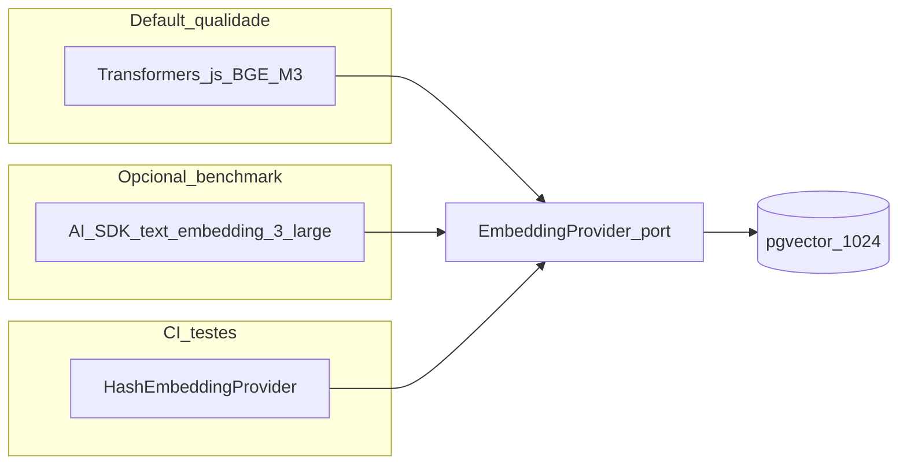
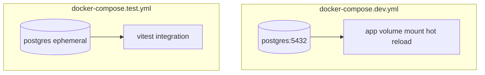
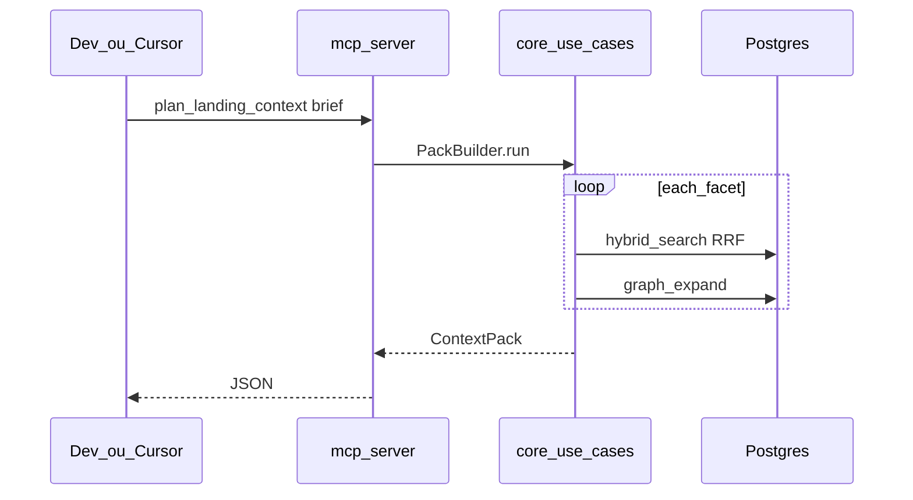
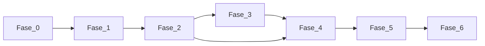

# Plano de execução — Knowledge Graph POC

## Decisão de linguagem: **TypeScript** (não Go)

| Critério | TypeScript | Go |
|----------|------------|-----|
| MCP oficial | [`@modelcontextprotocol/sdk`](https://www.npmjs.com/package/@modelcontextprotocol/sdk) maduro | SDKs comunitários, mais atrito |
| Sua familiaridade | Alta | Média |
| Performance POC (centenas–milhares de `.md`) | Suficiente (I/O: DB + API de embeddings) | Melhor em ingest CPU-bound massivo |
| Multithread | `worker_threads` / filas paralelas na ingestão | Goroutines nativas |

**Conclusão:** para **entregar a POC completa rápido** (incluindo MCP no Cursor), TypeScript é a escolha mais apropriada. Go faria sentido num serviço de ingestão em escala de milhões de arquivos; não é o gargalo documentado em [docs/01-visao-e-objetivos.md](docs/01-visao-e-objetivos.md).

**Padrão arquitetural:** Hexagonal (ports & adapters) — core testável sem Docker; adapters Postgres/MCP/embeddings substituíveis.

---

## Decisão de persistência: **PostgreSQL 16 + pgvector + tsvector**

Documentar em novo arquivo [docs/09-decisoes-stack.md](docs/09-decisoes-stack.md) com esta justificativa:

- **Um único serviço** no Docker (dev e test), alinhado ao critério “time-to-first-demo” em [docs/08-plano-poc.md](docs/08-plano-poc.md).
- **pgvector:** similarity search dos chunks ([docs/05-retrieval-hibrido.md](docs/05-retrieval-hibrido.md)).
- **tsvector + GIN:** BM25-like / full-text em português ([docs/02-conceitos-fundamentais.md](docs/02-conceitos-fundamentais.md)).
- **Grafo P0–P3:** tabelas `nodes`, `edges` + índices por tipo — expansão 1–2 hops via SQL recursivo (CTE), suficiente para a POC ([docs/04-ontologia-grafo.md](docs/04-ontologia-grafo.md)).
- **Neo4j** fica como evolução futura se queries de grafo passarem a dominar.
- **SQLite** descartado para integração: difícil isolar testes paralelos com mesmo padrão que Postgres.

---

## Decisão de embeddings: qualidade máxima (prioridade sobre performance)

Documentar em [docs/09-decisoes-stack.md](docs/09-decisoes-stack.md) junto com Postgres.

### Escolha principal: `@xenova/transformers` + **BGE-M3**

| Critério | Decisão |
|----------|---------|
| **Biblioteca** | [`@xenova/transformers`](https://github.com/xenova/transformers.js) — maior catálogo Hugging Face em Node.js, padrão de facto para inferência local em TS |
| **Modelo** | `Xenova/bge-m3` (BAAI BGE-M3) — **1024 dims**, multilíngue (PT/EN), topo em benchmarks MTEB entre modelos open locais; ideal para corpus de negócio/marketing/técnico em português |
| **Normalização** | L2-normalize vetores antes de persistir (cosine = dot product no pgvector) |
| **Onde roda** | Processo Node do `kg ingest` / worker dedicado; **sem API externa** no caminho feliz |

**Por que não as outras opções da sua pesquisa:**

| Opção | Veredito |
|-------|----------|
| **Embrix** (MiniLM/BGE 384d) | Descartado como padrão — MiniLM sacrifica qualidade; BGE-M3 é estritamente superior para retrieval semântico |
| **FastEmbed-js** | Reserva — bom throughput ONNX, mas menos flexível para trocar modelo; BGE-M3 via Transformers.js cobre qualidade + ecossistema |
| **EmbedJS** | **Não usar** — framework RAG completo; duplica ingestão/chunk/storage que já desenhamos (hexagonal + Postgres) |
| **ModelFusion / AI SDK só** | **Não como core** — útil como adapter opcional cloud (ver abaixo); nosso `EmbeddingProvider` port já cumpre o papel vendor-neutral |
| **Vectra / Vectorstore** | **Não usar** — storage local em arquivo; contradiz decisão Postgres+pgvector |
| **Chroma** | **Não usar** — serviço extra; pgvector basta na POC |
| **TurboQuant-js** | **Não usar** — quantização perde qualidade (contrário ao objetivo) |
| **embed-utils** | Usar só se precisarmos — pgvector já faz cosine; utilitário trivial inline |

### Fallback cloud (opcional, comparação de qualidade)

Adapter `adapter-embeddings-openai` com [Vercel AI SDK](https://sdk.vercel.ai/docs/ai-sdk-core/embeddings) `embed()`:

- Modelo: `text-embedding-3-large` (3072 dims) ou `text-embedding-3-small` — ativar via `EMBEDDING_PROVIDER=openai`
- Uso: benchmark A/B no `pnpm benchmark:recall` (mesmas queries, comparar Recall@10 vs BGE-M3)
- **Não é default** — evita custo/latência/API; só quando quiser validar se cloud supera local

### Testes (inalterado em espírito)

| Ambiente | Provider |
|----------|----------|
| CI / unit / integration rápidos | `HashEmbeddingProvider` — dimensão **configurável** (ex. 1024) para bater com schema pgvector nos testes |
| Dev / prod default | `TransformersEmbeddingProvider` (BGE-M3) |
| Benchmark opcional | `OpenAiEmbeddingProvider` |



### Docker (dev)

- Volume `hf_cache:/root/.cache/huggingface` no serviço `app` — evita re-download do modelo (~1–2 GB na 1ª execução)
- `docker-compose.dev.yml`: sem GPU obrigatória; inferência CPU aceitável (prioridade = qualidade, não latência)
- Documentar no README: primeira ingestão pode levar minutos (download + warm-up ONNX)

### Impacto técnico

- Migration pgvector: `vector(1024)` (não 384)
- Pacote: `packages/adapter-embeddings-transformers/` implementa `EmbeddingProvider`
- Pacote opcional: `packages/adapter-embeddings-openai/`

---

## Cursor Composer 2.5 (só extração GTM, não embeddings)

- O [`@cursor/sdk`](https://cursor.com/docs/api/sdk/typescript) expõe **agentes** — não API de embeddings.
- **Fase 3 (opcional):** `CursorAgentExtractor` com `Agent.prompt` + JSON schema para relações GTM (`hasPain`, `mentions`). `ENTITY_EXTRACTOR=rules|cursor|none`.

---

## Estrutura do repositório (alvo)

```text
knowledge-graph-poc/
  package.json                 # workspaces
  pnpm-workspace.yaml
  turbo.json                   # opcional: build/test paralelo
  docker/
    Dockerfile
    docker-compose.dev.yml
    docker-compose.test.yml
  packages/
    core/                      # domínio + casos de uso + ports
    adapter-postgres/
    adapter-embeddings-transformers/   # BGE-M3 default
    adapter-embeddings-openai/         # opcional benchmark cloud
    adapter-extractor-cursor/  # opcional Fase 3
    cli/                       # kg ingest | kg search | kg pack
    mcp-server/
  corpus/                      # ≥20 .md sintéticos (Fase 0)
  benchmark/
    queries.jsonl
  migrations/                  # SQL versionado (node-pg-migrate ou drizzle)
  docs/                        # já existente + 09-decisoes-stack.md
```

**Stack técnica:** Node 22 LTS, TypeScript 5.x, Vitest, testcontainers, `gray-matter` + `remark` (parse MD), `zod` (contratos), `pg` + `pgvector`.

---

## Docker: dev vs test (isolados)



| Ambiente | Compose | Porta host | Volume dados |
|----------|---------|------------|----------------|
| **Dev** | `docker-compose.dev.yml` | `5432` | `pgdata_dev` persistente |
| **Test** | `docker-compose.test.yml` | `5433` ou rede interna só | **sem** volume nomeado — descartável |

**Comandos alvo:**

- `pnpm dev:up` / `pnpm dev:down` — sobe Postgres dev
- `pnpm test` — unitários (sem Docker)
- `pnpm test:integration` — sobe `docker-compose.test.yml`, roda Vitest + testcontainers, derruba
- `pnpm mcp:dev` — MCP server apontando `KG_WORKSPACE` e DB dev

**CI (GitHub Actions):** job `unit` + job `integration` com service container Postgres ou testcontainers.

---

## Fases de implementação (granulares)

### Fase 0 — Fundação (infra + corpus)

**Entregáveis:** monorepo, Docker dev/test, migrations vazias, corpus de exemplo, `docs/09-decisoes-stack.md`.

| # | Tarefa | Testes |
|---|--------|--------|
| 0.1 | Inicializar monorepo pnpm + TS strict + ESLint/Prettier | — |
| 0.2 | `docker/Dockerfile` multi-stage (Node 22; runtime com deps ONNX — não usar alpine ultra-minimal se faltar libs) | build image em CI |
| 0.2b | Volume `hf_cache` no compose dev para cache do modelo BGE-M3 | smoke: 2ª ingest sem re-download |
| 0.3 | `docker-compose.dev.yml` (Postgres `pgvector/pgvector:pg16`) | healthcheck `pg_isready` |
| 0.4 | `docker-compose.test.yml` (rede `kg-test`, Postgres sem volume persistente) | script smoke: conectar e criar DB |
| 0.5 | Pacote `adapter-postgres`: migration inicial (extensions `vector`, tabelas placeholder) | integration: migration up/down |
| 0.6 | `corpus/` com ≥20 `.md` (business/market/technical + frontmatter + wikilinks) | fixture estático |
| 0.7 | `benchmark/queries.jsonl` (10–20 queries + `expected_paths` + `facet`) | schema Zod valida JSONL |
| 0.8 | Documentar stack em [docs/09-decisoes-stack.md](docs/09-decisoes-stack.md) | revisão humana |

---

### Fase 1 — Ingestão (grafo P0)

**Referência:** [docs/08-plano-poc.md](docs/08-plano-poc.md) Fase 1, ontologia P0 em [docs/04-ontologia-grafo.md](docs/04-ontologia-grafo.md).

| # | Tarefa | Testes |
|---|--------|--------|
| 1.1 | **Port** `MarkdownParser` → AST: frontmatter, headings, wikilinks `[[x]]`, blocos código | unit: fixtures MD → snapshot estrutural |
| 1.2 | **Chunker** por `##`/`###`, ~400 tokens, overlap 10%, proveniência `path`+`heading` | unit: limites, overlap, code blocks isolados |
| 1.3 | **Use case** `IngestWorkspace` — walk dir, hash `doc_id`, upsert idempotente | unit: mock stores |
| 1.4 | **Adapter Postgres:** `documents`, `sections`, `chunks`, `nodes`, `edges` (`contains`, `linksTo`) | integration: ingest corpus → contagens |
| 1.5 | **CLI** `kg ingest ./corpus` | integration: CLI exit 0 + stats stdout |
| 1.6 | Verificação: todo `chunk_id` rastreável `path` + heading | integration: query SQL proveniência 100% |

---

### Fase 2 — Índices (embeddings + BM25 + RRF)

**Referência:** [docs/05-retrieval-hibrido.md](docs/05-retrieval-hibrido.md).

| # | Tarefa | Testes |
|---|--------|--------|
| 2.1 | Migration: `chunk_embeddings vector(1024)`, índice HNSW (cosine); `chunks.search_vector` tsvector + GIN `portuguese` | integration: extensões ativas |
| 2.2 | Port `EmbeddingProvider` + `HashEmbeddingProvider` (CI, dim 1024) | unit: determinismo hash |
| 2.3 | `TransformersEmbeddingProvider` — `@xenova/transformers`, modelo `Xenova/bge-m3`, L2 normalize | unit: fixture curto → vetor 1024; integration: 1 chunk real |
| 2.4 | (Opcional) `OpenAiEmbeddingProvider` via `ai` SDK `embed()` — `text-embedding-3-large` | integration: skip se sem `OPENAI_API_KEY` |
| 2.5 | `IndexChunks` — batch sequencial ou baixa concorrência (CPU-bound; qualidade > throughput) | integration: corpus subset indexado |
| 2.6 | `LexicalIndex` — update tsvector on ingest | unit: termo exato rank > ausente |
| 2.7 | `RrfFusion` puro (k=60) | unit: listas conhecidas → ordem esperada |
| 2.8 | `HybridSearch` — dense top 50 + lexical top 50 → RRF → top 20 + dedup por `doc_id` | integration: corpus fixtures, query rotulada |
| 2.9 | **CLI** `kg search "query" --filters doc_type=market` | integration |
| 2.10 | **Benchmark** Recall@10 em `benchmark/queries.jsonl` com **BGE-M3** (default) | script `pnpm benchmark:recall` |
| 2.11 | (Opcional) `pnpm benchmark:recall --provider openai` — comparar qualidade vs cloud | relatório diff Recall@10 |

---

### Fase 3 — Grafo GTM (P1 + extração opcional)

| # | Tarefa | Testes |
|---|--------|--------|
| 3.1 | Mapear frontmatter → propriedades nó (`doc_type`, `audience`, `tags`) | unit |
| 3.2 | Wikilinks → `linksTo` entre `Document` | integration: corpus com links cruzados |
| 3.3 | `RulesExtractor` — menções simples / headings como entidades P1 | unit |
| 3.4 | (Opcional) `CursorAgentExtractor` via `@cursor/sdk` + Zod schema | integration: mock HTTP ou skip se sem API key |
| 3.5 | `GraphExpansion` — 1–2 hops com whitelist de `edge_types` | unit: grafo em memória; integration: Postgres CTE |
| 3.6 | **CLI** `kg expand --entity-id Persona:xxx --hops 2` | integration |
| 3.7 | Verificação: expansão de `Persona` retorna `PainPoint` + chunks | integration assert |

---

### Fase 4 — Context Pack (landing)

**Referência:** [docs/06-fluxo-landing-page.md](docs/06-fluxo-landing-page.md).

| # | Tarefa | Testes |
|---|--------|--------|
| 4.1 | Tipos Zod `Brief`, `ContextPack`, `Citation` | unit: round-trip JSON |
| 4.2 | `FacetPlanner` — 7 facets → sub-queries template | unit: brief → N queries |
| 4.3 | `PackBuilder` — por facet: HybridSearch + GraphExpansion + budget tokens + dedup global | unit: mocks; integration: corpus |
| 4.4 | Checklist `facets_covered` em `meta` | unit |
| 4.5 | **CLI** `kg pack --brief brief.json` | integration: 3 briefs → facets obrigatórias |
| 4.6 | Meta latência: log `duration_ms` (meta POC &lt;3s local — aspiracional) | benchmark script |

---

### Fase 5 — Servidor MCP

**Referência:** [docs/07-servidor-mcp.md](docs/07-servidor-mcp.md).

| # | Tarefa | Testes |
|---|--------|--------|
| 5.1 | `mcp-server` wiring `@modelcontextprotocol/sdk` stdio | smoke: inicia processo |
| 5.2 | Tools: `sync_workspace`, `hybrid_search`, `get_entity`, `expand_graph`, `get_chunk`, `plan_landing_context` | integration: cliente MCP in-process (JSON-RPC) |
| 5.3 | Resources: `kg://schema`, `kg://stats` | integration: leitura resource |
| 5.4 | Validar schemas entrada/saída (Zod → JSON Schema) | unit |
| 5.5 | Exemplo config Cursor em [docs/07-servidor-mcp.md](docs/07-servidor-mcp.md) | manual: registrar no IDE |
| 5.6 | Segurança: `sync_workspace` restrito a `KG_WORKSPACE` | unit: path traversal rejeitado |

---

### Fase 6 — Endurecimento e QA final

| # | Tarefa | Testes |
|---|--------|--------|
| 6.1 | README raiz: setup, env vars, comandos Docker, MCP | — |
| 6.2 | `pnpm test` + `pnpm test:integration` na CI | GitHub Actions |
| 6.3 | Cobertura mínima: **≥80%** em `packages/core` (meta POC; 90% como stretch) | vitest coverage |
| 6.4 | Re-executar Recall@10 + checklist landing manual ([docs/06-fluxo-landing-page.md](docs/06-fluxo-landing-page.md) §6) | relatório |

---

## Fluxo de dados final (validação E2E)



**Teste E2E (integration):** `corpus/` ingerido → `plan_landing_context` com brief fixture → assert seções não vazias + `citations[].path` existem no corpus.

---

## Variáveis de ambiente (resumo)

| Variável | Uso |
|----------|-----|
| `DATABASE_URL` | Postgres dev/test |
| `KG_WORKSPACE` | Raiz dos `.md` |
| `EMBEDDING_PROVIDER` | `transformers` (default) \| `hash` (CI) \| `openai` (benchmark) |
| `EMBEDDING_MODEL` | `Xenova/bge-m3` (default transformers) |
| `HF_HOME` / volume Docker | Cache de pesos Hugging Face |
| `OPENAI_API_KEY` | Só se `EMBEDDING_PROVIDER=openai` |
| `CURSOR_API_KEY` | Opcional: extração GTM |
| `ENTITY_EXTRACTOR` | `rules` \| `cursor` \| `none` |

---

## Ordem de execução e dependências



Fase 4 pode começar com expansão mockada antes da Fase 3 completa, mas **validação final** exige Fase 3.

---

## Riscos e mitigações (implementação)

| Risco | Mitigação no plano |
|-------|---------------------|
| UTF-16 em `.md` no Windows | normalizar no ingest; teste com corpus committed UTF-8 |
| Testes flaky com API real | `HashEmbeddingProvider` default em CI; BGE-M3 só em integration seletivos |
| Download modelo lento / CI pesado | cache `hf_cache`; job integration opcional; unit sempre com hash |
| RAM alta com BGE-M3 | documentar ~2–4 GB; batch size 1–8 em CPU |
| Dimensão fixa trocada | migration `vector(1024)`; reindex obrigatório ao mudar modelo |
| Postgres lento em Windows Docker | WSL2; volume named; índices HNSW após bulk load |
| MCP difícil de testar | cliente in-process + smoke stdio |

---

## O que NÃO entra nesta POC (explícito)

- UI administrativa do grafo
- Fine-tuning de embeddings
- Multi-tenant
- Neo4j / GraphRAG profundo
- Templates além de landing
