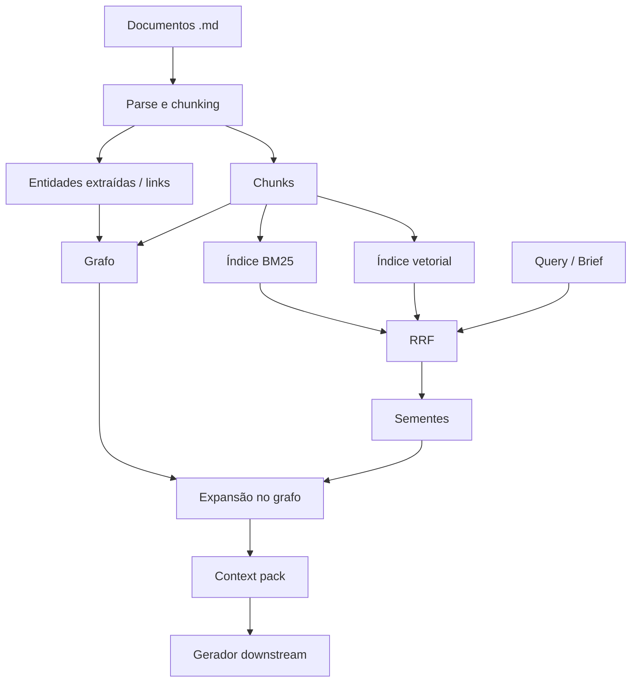

# Conceitos fundamentais

Glossário dos conceitos usados neste projeto e como se relacionam.

---

## Corpus e documentos

| Conceito         | Definição                                                                              |
| ---------------- | -------------------------------------------------------------------------------------- |
| **Documento**    | Um arquivo `.md` com identificador estável (`doc_id`, path).                           |
| **Corpus**       | Conjunto de documentos ingeridos.                                                      |
| **Frontmatter**  | Metadados YAML no topo do MD (`tags`, `type`, `audience`) — viram propriedades de nós. |
| **Proveniência** | Rastreio `chunk → section → document → path` para citações e auditoria.                |

---

## Chunking

Texto longo é dividido em **chunks** para indexação e retrieval.

| Regra                            | Motivo                                                          |
| -------------------------------- | --------------------------------------------------------------- |
| Preferir limites em `##` / `###` | Preserva contexto semântico e títulos para BM25                 |
| Tamanho alvo ~200–800 tokens     | Balanceia precisão do embedding e granularidade                 |
| Overlap pequeno (ex.: 10–15%)    | Evita cortar frases críticas na fronteira                       |
| Blocos de código separados       | Stack docs: retrieval técnico sem misturar narrativa de negócio |

Cada chunk é unidade de indexação nos índices **vetorial** e **BM25**.

---

## Grafo de conhecimento

Modelo **atribuído** (nós com tipo e propriedades; arestas com tipo e opcionalmente peso).

- **Nó:** entidade ou artefato (`Product`, `Persona`, `Chunk`, `Document`, …).
- **Aresta:** relação tipada (`targets`, `hasPain`, `citedIn`, …).
- **Navegação:** percorrer arestas a partir de sementes (entidades ou chunks recuperados).

O grafo **não substitui** busca por texto; complementa com **estrutura e expansão**.

Ver [04-ontologia-grafo.md](./04-ontologia-grafo.md).

---

## Embeddings (busca semântica / RAG denso)

Representação vetorial do chunk em espaço de similaridade.

- **Consulta** em linguagem natural → vetor da query → vizinhos mais próximos (top‑k).
- **Força:** paráfrases, conceitos sem vocabulário exato compartilhado.
- **Fraqueza:** termos raros, siglas, nomes próprios podem "afundar" no ruído semântico.

---

## BM25 (busca léxica)

Ranking probabilístico por correspondência de termos (TF-IDF moderno).

- **Força:** nomes de produto, concorrentes, siglas, stack, IDs.
- **Fraqueza:** não captura bem sinônimos e reformulações.

No nosso domínio (negócio + mercado + técnico), BM25 é **complementar**, não opcional.

---

## Reciprocal Rank Fusion (RRF)

Fusão de **listas ranqueadas** sem normalizar scores entre retrievers:

\[
\text{score}(d) = \sum_i \frac{1}{k + \text{rank}\_i(d)}
\]

- Constante **k** padrão: **60**.
- Cada documento/chunk recebe contribuição de cada lista em que aparece.
- Resultado: top‑K unificado para downstream (expansão no grafo, montagem de pack).

Ver [05-retrieval-hibrido.md](./05-retrieval-hibrido.md).

---

## Expansão no grafo (pós-retrieval)

Após RRF (ou busca única), entidades mencionadas nos top chunks viram **sementes**.

- Percorrer **1–2 hops** com filtros de tipo de aresta.
- Anexar chunks ligados a nós descobertos (`citedIn`, `mentions`, …).
- Objetivo: **cobertura** de facets (persona, dor, benefício) sem duplicar o mesmo tema.

---

## Context pack

Artefato **estruturado** entregue ao LLM gerador (não um dump de chunks).

Seções típicas: Positioning, Audience & pains, Differentiation, Features → benefits, Proof, Technical credibility (opcional).

Cada seção: texto resumido ou trechos + **citações** (`doc_id`, heading, chunk_id).

---

## MCP (Model Context Protocol)

Protocolo para expor **tools** e **resources** a clientes (Cursor, agentes customizados).

- **Tools:** ações (`hybrid_search`, `plan_landing_context`, …).
- **Resources:** dados read-only (estatísticas do corpus, schema do grafo).
- O **core** do projeto não depende do MCP; o adaptador traduz chamadas MCP → API interna.

Ver [07-servidor-mcp.md](./07-servidor-mcp.md).

---

## Relação entre conceitos (diagrama)

