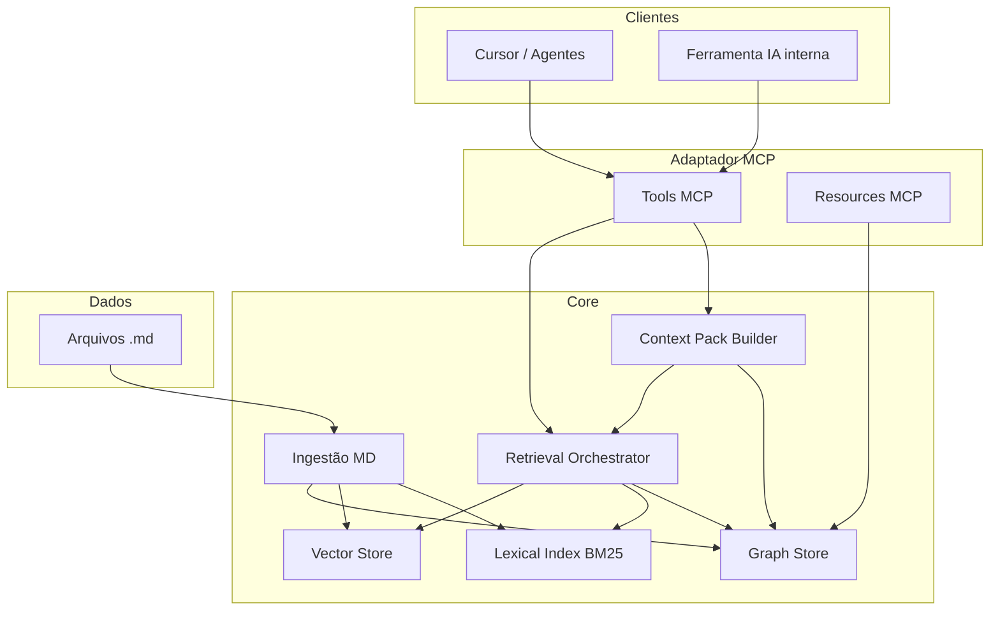

# Arquitetura do sistema (camadas)

## 1. Visão em camadas

---

## 2. Componentes

| Camada | Responsabilidade |
|--------|------------------|
| **Ingestão** | Watch/sync, parse MD, chunking, extração de entidades/links, upsert nos stores |
| **Graph Store** | Nós, arestas, queries de vizinhança |
| **Vector Store** | Embeddings de chunks, similarity search |
| **Lexical Index** | BM25 / FTS sobre texto de chunks |
| **Retrieval Orchestrator** | RRF, dedup, filtros (`doc_type`, tags) |
| **Context Pack Builder** | Planner de facets + montagem do pack |
| **MCP Adapter** | JSON-RPC, schemas, auth |

---

## 3. Fluxo de dados

### 3.1 Sync (ingestão)

1. Detectar arquivos `.md` novos ou alterados.
2. Parse: frontmatter, árvore de headings, wikilinks.
3. Gerar chunks com metadados de proveniência.
4. Upsert: grafo (`Document`, `Section`, `Chunk`, entidades) + índices vetorial e BM25.

### 3.2 Query (retrieval + pack)

1. Entrada: query NL ou `Brief` (landing).
2. Planner decompõe em sub-queries (se landing).
3. Por sub-query: dense + BM25 → RRF → dedup.
4. Sementes → expansão 1–2 hops no grafo.
5. Montagem do `ContextPack` com budget de tokens.

### 3.3 Geração (fora do core)

Cliente LLM consome o pack e produz artefato final (HTML/copy da landing).

---

## 4. Separação core vs MCP

O **core** expõe uma API interna (biblioteca ou serviço HTTP local). O **adaptador MCP** apenas:

- Valida parâmetros das tools.
- Chama o core.
- Serializa respostas no formato MCP.

Isso permite testar ingestão e retrieval via CLI/scripts sem cliente MCP.

---

## 5. Leitura relacionada

- [04-ontologia-grafo.md](./04-ontologia-grafo.md) — modelo de dados do Graph Store.
- [05-retrieval-hibrido.md](./05-retrieval-hibrido.md) — Retrieval Orchestrator em detalhe.
- [07-servidor-mcp.md](./07-servidor-mcp.md) — contrato das tools.
