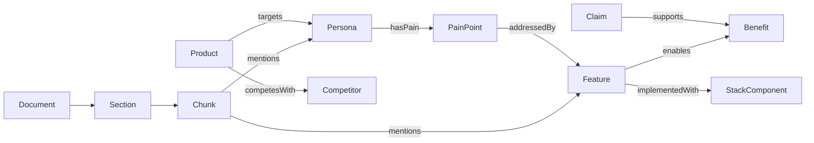

# Ontologia do grafo (GTM / documentação)

Modelo mínimo para suportar discovery de conteúdo para síntese (landing page e tarefas similares). Evolui em fases — ver seção 3.

---

## 1. Tipos de nó

| Tipo             | Descrição                | Propriedades exemplo              |
| ---------------- | ------------------------ | --------------------------------- |
| `Document`       | Arquivo `.md`            | `path`, `doc_type`, `updated_at`  |
| `Section`        | Bloco sob heading        | `heading`, `level`                |
| `Chunk`          | Unidade de indexação     | `text`, `token_count`, `chunk_id` |
| `Product`        | Oferta / produto         | `name`                            |
| `Persona`        | Público-alvo             | `name`, `segment`                 |
| `PainPoint`      | Dor do cliente           | `label`                           |
| `Feature`        | Capacidade do produto    | `name`                            |
| `Benefit`        | Resultado para o cliente | `label`                           |
| `Competitor`     | Concorrente              | `name`                            |
| `Claim`          | Afirmação / prova        | `text`, `metric`                  |
| `StackComponent` | Tech da stack padrão     | `name`, `category`                |

---

## 2. Tipos de aresta

| Aresta            | De → Para                  | Origem típica                   |
| ----------------- | -------------------------- | ------------------------------- |
| `contains`        | Document → Section → Chunk | Parse estrutural                |
| `mentions`        | Chunk → Entity             | NER / regex / LLM com schema    |
| `citedIn`         | Entity → Chunk             | Inverso de `mentions`           |
| `targets`         | Product → Persona          | Docs de negócio                 |
| `hasPain`         | Persona → PainPoint        | Pesquisa de mercado             |
| `addressedBy`     | PainPoint → Feature        | Negócio + técnico               |
| `enables`         | Feature → Benefit          | Negócio                         |
| `implementedWith` | Feature → StackComponent   | Docs técnicos                   |
| `competesWith`    | Product → Competitor       | Mercado                         |
| `supports`        | Claim → Benefit            | Métricas, cases                 |
| `contradicts`     | Claim → Claim              | Fase 2 — detecção manual ou LLM |
| `linksTo`         | Document → Document        | Wikilinks `[[...]]`             |

---

## 3. Fases de riqueza do grafo

| Fase   | O que construir                                       | Valor                               |
| ------ | ----------------------------------------------------- | ----------------------------------- |
| **P0** | `Document`, `Section`, `Chunk`, `contains`, `linksTo` | Proveniência + navegação entre docs |
| **P1** | Entidades via frontmatter + headings + wikilinks      | Grafo útil sem LLM pesado           |
| **P2** | Extração assistida (LLM + JSON schema fixo) para GTM  | Relações `hasPain`, `enables`, etc. |
| **P3** | `contradicts`, pesos, versionamento                   | Consistência em corpus vivo         |

---

## 4. Proveniência

Todo nó derivado de texto deve permitir voltar à fonte:

```
Chunk.chunk_id → Section.heading → Document.path
```

Citações no `ContextPack` usam esse encadeamento.

---

## 5. Filtros por tipo de documento

Frontmatter sugerido nos `.md` do corpus:

```yaml
---
type: business | market | technical
audience: enterprise-cto | smb-founder | ...
tags: [pricing, compliance]
---
```

O retrieval e a expansão no grafo podem **restringir** tipos (ex.: landing B2C ignora expansão massiva por `StackComponent`).

---

## 6. Diagrama simplificado



---

## 7. Leitura relacionada

- [05-retrieval-hibrido.md](./05-retrieval-hibrido.md) — como o grafo entra após RRF.
- [06-fluxo-landing-page.md](./06-fluxo-landing-page.md) — quais tipos cada facet prioriza.
