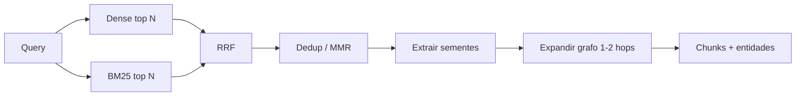

# Retrieval híbrido

Pipeline de busca que combina **embeddings (denso)**, **BM25 (léxico)** e **Reciprocal Rank Fusion (RRF)**, seguido de **expansão no grafo**.

---

## 1. Pipeline end-to-end

| Etapa | Descrição                                             |
| ----- | ----------------------------------------------------- |
| 1     | Query (ou sub-query do planner)                       |
| 2     | **Dense:** top `N_dense` (ex.: 50)                    |
| 3     | **BM25:** top `N_lex` (ex.: 50)                       |
| 4     | **RRF** → top `K_rrf` (ex.: 20)                       |
| 5     | **Dedup** por `doc_id` / similaridade (MMR opcional)  |
| 6     | **Extrair sementes:** entidades nos chunks            |
| 7     | **Expandir grafo:** 1–2 hops com whitelist de arestas |
| 8     | Anexar chunks de nós alcançados                       |

---

## 2. Reciprocal Rank Fusion (RRF)

\[
\text{score}(d) = \sum_i \frac{1}{k + \text{rank}\_i(d)}
\]

| Parâmetro          | Valor inicial (POC) | Nota                     |
| ------------------ | ------------------- | ------------------------ |
| `k`                | 60                  | Literatura clássica      |
| `N_dense`, `N_lex` | 50                  | Por canal                |
| `K_rrf`            | 20                  | Saída para expansão/pack |

**Por que RRF:** não exige normalizar score de similaridade coseno com score BM25.

---

## 3. Parâmetros de chunking (ingestão)

| Parâmetro    | Valor inicial         |
| ------------ | --------------------- |
| Tamanho alvo | ~400 tokens           |
| Overlap      | 10%                   |
| Limites      | Headings `##` / `###` |

---

## 4. Filtros

Aplicáveis em dense, BM25 e/ou pós-RRF:

| Filtro     | Uso                                   |
| ---------- | ------------------------------------- |
| `doc_type` | `business` \| `market` \| `technical` |
| `audience` | Frontmatter — alinhar ao brief        |
| `tags`     | Subconjuntos temáticos                |

**Landing B2C:** limitar ou excluir expansão via `StackComponent` salvo brief dev-facing.

---

## 5. Grafo e RRF

**Recomendação para a POC:** o grafo **não** entra no score do RRF.

| Sinal              | Papel                                              |
| ------------------ | -------------------------------------------------- |
| Dense + BM25 + RRF | Ranquear chunks por relevância textual à sub-query |
| Expansão no grafo  | Cobertura de facets e conceitos ligados            |

Isso evita misturar ranks incompatíveis e mantém o grafo focado em **navegação estruturada**.

---

## 6. Whitelist de arestas (expansão)

Para tarefas GTM / landing, priorizar:

- `hasPain`, `addressedBy`, `enables`, `targets`, `competesWith`, `supports`, `citedIn`, `mentions`

Evitar na expansão padrão (salvo filtro explícito):

- `implementedWith` → `StackComponent` em volume alto

---

## 7. Dedup e MMR

Problema: vários chunks do mesmo doc ranqueiam alto após RRF.

| Técnica            | Ação                                                    |
| ------------------ | ------------------------------------------------------- |
| Dedup por `doc_id` | Máximo N chunks por documento no top K                  |
| MMR (opcional)     | Diversificar por similaridade entre chunks selecionados |

---

## 8. Leitura relacionada

- [02-conceitos-fundamentais.md](./02-conceitos-fundamentais.md) — definições de BM25, RRF, expansão.
- [06-fluxo-landing-page.md](./06-fluxo-landing-page.md) — múltiplas sub-queries por facet.
