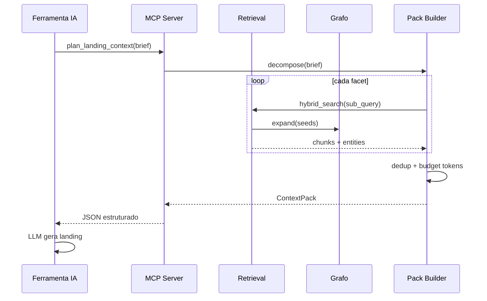

# Fluxo: Context pack para landing page

Caso de uso de referência que valida o desenho do sistema: da documentação dispersa ao contexto estruturado para um LLM gerar uma landing page.

---

## 1. Entrada (Brief)

```json
{
  "product": "string",
  "persona": "string",
  "goal": "string",
  "tone": "string",
  "constraints": ["optional"]
}
```

| Campo         | Exemplo                           |
| ------------- | --------------------------------- |
| `product`     | Nome da oferta / produto          |
| `persona`     | "CTO enterprise", "SMB founder"   |
| `goal`        | "Conversão trial", "Agendar demo" |
| `tone`        | "Confiante, técnico-leve"         |
| `constraints` | "Não mencionar preço", "PT-BR"    |

---

## 2. Planner — facets

O planner decompõe o brief em **sub-queries** (não uma busca monolítica).

| Facet                   | Sub-queries exemplo                              |
| ----------------------- | ------------------------------------------------ |
| `positioning`           | proposta de valor, posicionamento para {persona} |
| `audience_pains`        | dores, jobs-to-be-done {persona}                 |
| `differentiation`       | vs concorrentes, diferenciais                    |
| `features_benefits`     | features que endereçam dores                     |
| `proof`                 | métricas, cases, credibilidade                   |
| `objections`            | objeções comuns e respostas                      |
| `technical_credibility` | segurança, stack (se landing dev-facing)         |

Por facet: executar pipeline de [05-retrieval-hibrido.md](./05-retrieval-hibrido.md).

---

## 3. Diagrama de sequência



---

## 4. Formato ContextPack (esboço)

```json
{
  "brief": {
    "product": "",
    "persona": "",
    "goal": "",
    "tone": ""
  },
  "sections": {
    "positioning": {
      "content": "",
      "citations": [{ "chunk_id": "", "path": "", "heading": "" }]
    },
    "audience_pains": {
      "content": "",
      "citations": []
    },
    "differentiation": {
      "content": "",
      "citations": []
    },
    "features_benefits": {
      "content": "",
      "citations": []
    },
    "proof": {
      "content": "",
      "citations": []
    },
    "objections": {
      "content": "",
      "citations": []
    },
    "technical_credibility": {
      "content": "",
      "citations": []
    }
  },
  "meta": {
    "token_estimate": 0,
    "facets_covered": []
  }
}
```

---

## 5. Budget de tokens

| Regra            | Valor sugerido                                               |
| ---------------- | ------------------------------------------------------------ |
| Pack total       | 4k–8k tokens                                                 |
| Por seção        | Proporcional à importância da facet para o `goal`            |
| Prioridade baixa | `technical_credibility` omitível se brief não for dev-facing |

---

## 6. Checklist de cobertura (QA manual)

- [ ] Proposta de valor clara para a persona
- [ ] Pelo menos 2 dores com evidência citada
- [ ] Diferenciação vs concorrência (se existir no corpus)
- [ ] Features ligadas a benefícios (não lista técnica solta)
- [ ] Pelo menos 1 prova (métrica, case, credencial)
- [ ] Citações resolvem para arquivos reais do corpus

---

## 7. Armadilhas conhecidas

| Problema                              | Mitigação                                                        |
| ------------------------------------- | ---------------------------------------------------------------- |
| Retrieval traz só arquitetura técnica | Filtro `doc_type`; whitelist de arestas na expansão              |
| Chunks redundantes entre facets       | Dedup global ao montar o pack                                    |
| Contradição entre docs de negócio     | Fase 3: aresta `contradicts`; na POC, priorizar doc mais recente |
| Query única "landing page"            | Sempre usar planner de facets                                    |

---

## 8. Leitura relacionada

- [01-visao-e-objetivos.md](./01-visao-e-objetivos.md) — métricas de sucesso do caso landing.
- [07-servidor-mcp.md](./07-servidor-mcp.md) — tool `plan_landing_context`.
