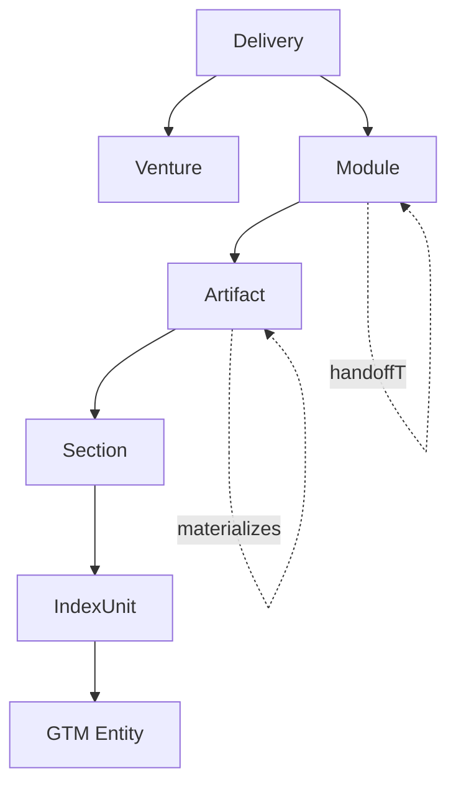
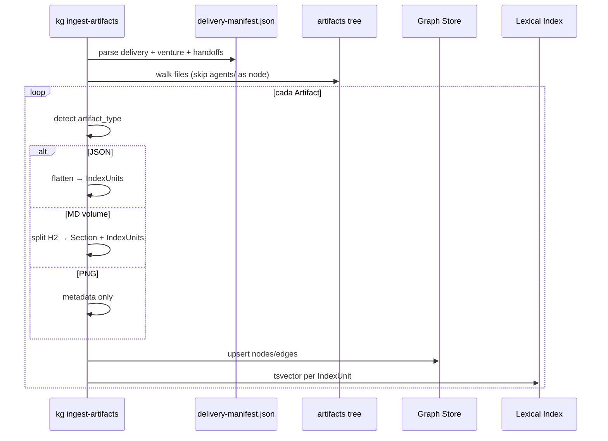

# Proposta: indexação centrada em artefatos (v2)

Especificação **greenfield** que substitui o ingest **corpus-only** (`corpus/` → `Folder`/`File`). A fonte de verdade passa a ser a árvore de entregas em [`artifacts/artifacts/`](../artifacts/artifacts/), com metadados derivados de [`docs/artifacts-catalog/`](./artifacts-catalog/INDEX.md).

> **Regra central:** o segmento de path `agents/` existe **apenas no filesystem** (organização de pastas do pipeline). **Nunca** vira nó, facet de busca nem propriedade indexada `agent`.

---

## 1. Motivação e escopo

| Aspecto | Corpus-only (legado) | Artifacts v2 |
| ------- | -------------------- | ------------ |
| Unidade primária | Arquivo `.md` genérico | **Artifact** (arquivo de entrega com `artifact_type`) |
| Hierarquia | Pastas do repo | **Delivery → Module → Artifact** |
| Metadados | Frontmatter opcional | `delivery-manifest.json` + catálogo + path |
| Chunking | `##` / `###` em qualquer MD | `volume_markdown` por **H2**; JSON → **IndexUnits** achatados |
| Facets de retrieval | `doc_type` | `delivery_id`, `venture_id`, `opportunity_id`, `module`, `artifact_type`, `volume` |

**Fora do escopo v2 inicial:** OCR, ingest de PDF binário, extração LLM em massa sem schema, nós `Agent` ou `WorkflowRun` como entidades de grafo.

---

## 2. Entrega de referência (B4U.bet)

IDs e módulos vêm de [`artifacts/artifacts/_meta/delivery-manifest.json`](../artifacts/artifacts/_meta/delivery-manifest.json):

| Campo | Valor |
| ----- | ----- |
| `delivery_id` | `del-b4u-bet-2026-05-20` |
| `startup_name` / marca | `B4U.bet` |
| `venture_id` | `v-b4u-bet-001` |
| `opportunity_id` | `opp-b4u-bet-2026-001` |
| `legal_name` | `B4U Intelligence Ltda.` |
| `modules` | `opportunity`, `add-venture`, `brand-aid` |
| `delivered_at` | `2026-05-20T18:00:00Z` |

Cadeia de handoff (arestas `handoffTo` entre módulos):


---

## 3. Modelo de grafo (v2)

Complementa e **substitui** a ontologia corpus em [04-ontologia-grafo.md](./04-ontologia-grafo.md) para entregas. Tipos legados (`Folder`, `File` sobre `corpus/`) permanecem apenas se coexistência temporária for necessária; o ingest v2 não cria novos nós corpus.

### 3.1 Tipos de nó

| Tipo | Descrição | Propriedades principais |
| ---- | ----------- | ------------------------ |
| `Delivery` | Uma entrega completa ao cliente | `delivery_id`, `brand_name`, `delivered_at`, `source_brief` |
| `Venture` | Venture estruturada na entrega | `venture_id`, `opportunity_id`, `legal_name`, `brand_name` |
| `Module` | Módulo de pipeline (`opportunity`, `add-venture`, `brand-aid`, `_meta`) | `module_id` (= nome da pasta), `delivery_id` |
| `Artifact` | Arquivo físico sob `artifacts/artifacts/` | `artifact_id`, `path`, `artifact_type`, `mime`, `content_hash`, `module`, `volume` (opcional) |
| `IndexUnit` | Unidade indexável (BM25 + embedding) | `index_unit_id`, `text`, `token_count`, `ordinal`, `source_kind` (`markdown_section` \| `json_leaf`) |
| `Section` | Subdivisão opcional dentro de artifact MD | `heading`, `level` (=2), `ordinal`, `start_line`, `end_line` |
| *GTM* | Entidades extraídas do **texto** dos artifacts | `Product`, `Persona`, `PainPoint`, `Feature`, `Benefit`, `Competitor`, `Claim`, … (mesmo vocabulário de [04-ontologia-grafo.md](./04-ontologia-grafo.md)) |

**Identificadores estáveis:**

- `artifact_id` = hash estável de `delivery_id` + `path` normalizado (POSIX, relativo a `artifacts/artifacts/`).
- `index_unit_id` = `artifact_id` + sufixo (`#h2:3`, `#json:revenue_streams.0`, …).

### 3.2 Tipos de aresta

| Aresta | De → Para | Semântica |
| ------ | --------- | --------- |
| `belongsToDelivery` | `Venture` \| `Module` \| `Artifact` → `Delivery` | Proveniência da entrega |
| `partOfModule` | `Artifact` → `Module` | Pasta de primeiro nível após `artifacts/artifacts/` (`opportunity`, `add-venture`, …) |
| `contains` | `Delivery` → `Module`; `Module` → `Artifact`; `Artifact` → `Section` → `IndexUnit` | Árvore estrutural |
| `aggregates` | `Artifact` → `Artifact` | Ex.: `venture-dossier.json` agrega volumes; manifest referencia lista de paths |
| `references` | `Artifact` \| `IndexUnit` → `Artifact` | Wikilinks, campos path/ID em JSON, `image_prompt_files` no manifest |
| `materializes` | `Artifact` (`.image-prompt.md`) → `Artifact` (`.png`) | Par prompt → imagem gerada |
| `handoffTo` | `Module` → `Module` | Gate entre módulos (`handoff_chain` no manifest) |
| `mentions` | `IndexUnit` → entidade GTM | NER / regex / LLM com schema fixo (P2) |



### 3.3 Path `agents/` — somente filesystem

Exemplo de path físico:

```text
artifacts/artifacts/add-venture/agents/briefing-interpreter/vol-0-intake.json
```

| Segmento | Indexado como |
| -------- | ------------- |
| `add-venture` | `module` = `add-venture` |
| `agents` | **Ignorado** (não é facet, não é nó) |
| `briefing-interpreter` | **Ignorado** na v2 (papel descrito só no catálogo humano) |
| `vol-0-intake.json` | `Artifact` + `artifact_type` + `volume` (se aplicável) |

O catálogo em `docs/artifacts-catalog/**` pode mencionar “agente” para documentação humana; o **ingest v2 não propaga** esse rótulo ao grafo nem aos filtros MCP.

---

## 4. Taxonomia `artifact_type`

Valores normalizados (`snake_case`) derivados da seção **Tipo de conteúdo** de cada entrada em [`docs/artifacts-catalog/`](./artifacts-catalog/INDEX.md).

| `artifact_type` | Extensão / padrão | Módulos típicos | Indexação |
| --------------- | ----------------- | --------------- | --------- |
| `delivery_manifest` | `_meta/delivery-manifest.json` | `_meta` | JSON → IndexUnits; nó `Delivery` |
| `delivery_readme` | `README.md` (raiz artifacts) | `_delivery` | MD por H2 se houver; senão 1 IndexUnit |
| `workflow_summary` | `workflows/**/**.json` | todos | JSON flatten |
| `market_research` | `market-research.json`, pesquisas | `opportunity` | JSON flatten |
| `opportunity_score` | `opportunity-score.json` | `opportunity` | JSON flatten |
| `ranked_opportunities` | `ranked-opportunities.json` | `opportunity` | JSON flatten |
| `deep_analysis` | `deep-analysis.md` | `opportunity` | H2 chunking |
| `venture_intake` | `vol-0-intake.json` | `add-venture` | JSON flatten; `volume`=0 |
| `venture_volume_md` | `vol-*-*.md` (narrativo) | `add-venture` | H2 chunking; `volume` do frontmatter ou nome |
| `venture_volume_json` | `vol-*-*.json` (estruturado) | `add-venture` | JSON flatten |
| `venture_dossier` | `venture-dossier.json` | `add-venture` | JSON + `aggregates` para volumes |
| `venture_dossier_export` | `venture-dossier.pdf.md` | `add-venture` | H2 chunking |
| `venture_critique` | `critique-result.json` | `add-venture` | JSON flatten |
| `structuring_summary` | `structuring-summary.json` | `add-venture` | JSON flatten |
| `brand_strategy` | `brand-strategy.json` | `brand-aid` | JSON flatten |
| `design_tokens` | `design-tokens.json` | `brand-aid` | JSON flatten |
| `naming_shortlist` | `naming-shortlist.json` | `brand-aid` | JSON flatten |
| `creative_brief` | `creative-brief.md` | `brand-aid` | H2 chunking |
| `brand_book_outline` | `brand-book-outline.md` | `brand-aid` | H2 chunking |
| `competitor_white_space` | `competitor-white-space.md` | `brand-aid` | H2 chunking |
| `brand_critique` | `critique-result.json` | `brand-aid` | JSON flatten |
| `pipeline_summary` | `pipeline-summary.json` | `brand-aid` | JSON flatten |
| `image_prompt` | `*.image-prompt.md` | `brand-aid` | Metadados YAML + corpo; aresta `materializes` |
| `image_asset` | `*.png` | `brand-aid` | **Somente metadados v1** (sem embedding de pixels) |

**Detecção:** regras por path glob + extensão; override opcional via companion no catálogo. Conflito: prevalece tabela acima + manifest.

---

## 5. Estratégias de decomposição

### 5.1 `volume_markdown` — chunking por H2

Aplica-se a `artifact_type` ∈ { `venture_volume_md`, `deep_analysis`, `creative_brief`, … }.

| Regra | Valor |
| ----- | ----- |
| Limite estrutural | Cada `##` inicia um `Section` + um ou mais `IndexUnit` |
| Subdivisão | Se bloco H2 > ~800 tokens, subdividir em parágrafos com overlap 10% |
| Propriedade `volume` | Extraída de campo `volume` no JSON irmão, frontmatter, ou regex `vol-(\d+)` no path |
| Proveniência | `index_unit_id` → `artifact_id` → `path`; linhas `start_line` / `end_line` quando possível |

### 5.2 JSON — flatten para IndexUnits

Aplica-se a artifacts JSON (`venture_intake`, `design_tokens`, `workflow_summary`, …).

**Algoritmo (flatten semântico):**

1. Parse JSON; rejeitar binário.
2. Campos escalares no topo (`venture_id`, `volume`, `confidence`, …) → **um** IndexUnit de cabeçalho com pares `chave: valor` em texto.
3. Cada elemento de array de “registros” (ex.: `revenue_streams[]`, `handoff_chain[]`) → IndexUnit com `path_json` (`revenue_streams[0]`).
4. Objetos aninhados até profundidade 4 → frases naturais; abaixo disso, serializar JSON compacto em um único IndexUnit.
5. Números e métricas preservados no texto para BM25 (`LTV`, `R$`, `%`, nomes de concorrentes).

**Exemplo** (`vol-4-business-model.json`):

```text
[IndexUnit #json:header]
volume: 4 | venture: B4U.bet | Business Model & Unit Economics

[IndexUnit #json:revenue_streams.0]
stream: premium_subscription | year_1_share_pct: 45 | notes: BR pricing R$39-59/mo; annual plan
```

### 5.3 `image_prompt` + `image_asset` (v1 metadados)

| Arquivo | v1 |
| ------- | -- |
| `*.image-prompt.md` | Indexar frontmatter YAML + prompt; facet `artifact_type=image_prompt` |
| `*.png` | Nó `Artifact` com `mime=image/png`, `content_hash`, dimensões se disponíveis; **sem** chunk de pixels; opcional caption vazia |
| Ligação | `materializes` prompt → png; entrada em `image_prompt_files` do manifest gera `references` |

---

## 6. Facets e filtros de retrieval

Facets **obrigatórias** nos filtros MCP/API v2 (substituem ou estendem `doc_type` para entregas):

| Facet | Exemplo B4U | Origem |
| ----- | ------------- | ------ |
| `delivery_id` | `del-b4u-bet-2026-05-20` | manifest |
| `venture_id` | `v-b4u-bet-001` | manifest / JSON volumes |
| `opportunity_id` | `opp-b4u-bet-2026-001` | manifest / JSON volumes |
| `module` | `add-venture` | 1º segmento de path |
| `artifact_type` | `venture_volume_md` | taxonomia §4 |
| `volume` | `3` | nome arquivo / campo JSON |

**Proibido como facet:** `agent`, `agents`, slug sob `agents/`.

---

## 7. CLI e MCP

### 7.1 CLI (novo)

```bash
# Ingest completo da entrega (default: artifacts/artifacts)
pnpm kg ingest-artifacts [path]

# Variáveis (ver .env)
# KG_ARTIFACTS_ROOT=./artifacts/artifacts
# DATABASE_URL=...
```

| Comando | Ação |
| ------- | ---- |
| `kg ingest-artifacts` | Lê manifest → upsert `Delivery`, `Venture`, `Module`, `Artifact`, `IndexUnit`, arestas estruturais; BM25/tsvector |
| `kg index` | Embeddings dos `IndexUnit` pendentes (inalterado) |

O ingest corpus (`pnpm kg ingest ./corpus`) permanece **deprecado** para novas entregas; não deve ser misturado no mesmo `delivery_id` sem flag explícita.

### 7.2 MCP (planejado)

| Tool | Descrição |
| ---- | --------- |
| `kg_ingest_artifacts` | Equivalente ao CLI; path relativo a `KG_ARTIFACTS_ROOT` |
| `kg_search` | `filters`: `delivery_id`, `venture_id`, `opportunity_id`, `module`, `artifact_type`, `volume` |
| `kg_expand` | Sementes `artifact:<id>` ou entidade GTM |
| `kg_pack` | Context pack landing ([06](./06-fluxo-landing-page.md), [12](./12-roteiro-landing-via-grafo.md)) |

---

## 8. Fases de implementação

| Fase | Entregável | Critério de pronto |
| ---- | ---------- | ------------------- |
| **P0** | `Delivery`, `Module`, `Artifact`, `IndexUnit`, `contains`, `belongsToDelivery`, `partOfModule`, ingest MD por H2 + JSON flatten, CLI `ingest-artifacts` | B4U indexado; busca por `module` e `artifact_type` |
| **P1** | `aggregates`, `references`, `handoffTo`, `materializes`, manifest-driven links | Grafo navegável no Explorer entre módulos e prompt→png |
| **P2** | `mentions` + entidades GTM a partir de `venture_volume_md` e `deep_analysis` | Expansão 1–2 hops enriquece `kg_pack` |


---

## 9. Diagrama de ingest



---

## 10. Relação com documentação existente

| Documento | Relação |
| --------- | ------- |
| [04-ontologia-grafo.md](./04-ontologia-grafo.md) | Entidades GTM e fases P2+; tipos corpus legados |
| [05-retrieval-hibrido.md](./05-retrieval-hibrido.md) | RRF e expansão aplicados a `IndexUnit` |
| [docs/artifacts-catalog/](./artifacts-catalog/INDEX.md) | Fonte da taxonomia `artifact_type` |
| [12-roteiro-landing-via-grafo.md](./12-roteiro-landing-via-grafo.md) | Playbook MCP pós-indexação |

---

## 11. Checklist de QA (ingest B4U)

- [ ] `delivery_id` `del-b4u-bet-2026-05-20` presente em todos os artifacts
- [ ] Nenhum nó ou facet `agent` / `briefing-interpreter` no grafo
- [ ] 8 volumes `venture_volume_*` com `volume` 0–8 coerente
- [ ] `handoffTo`: opportunity → add-venture → brand-aid
- [ ] 7 pares `image_prompt` → `png` com `materializes`
- [ ] `kg_search` com `module=brand-aid` retorna `design_tokens` e não ruído de opportunity
