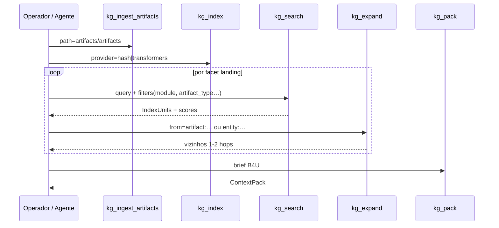
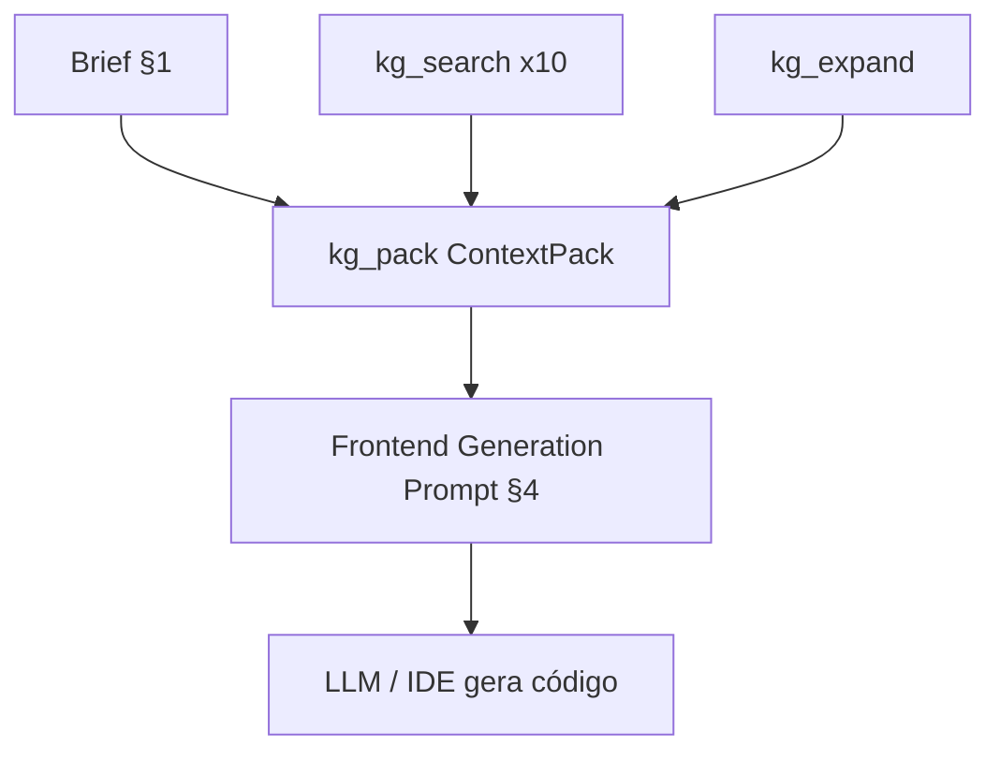

# Roteiro: landing de conversão via grafo e MCP

Playbook mínimo para montar um **prompt de geração frontend** de nível mundial a partir do grafo indexado em [11-proposta-indexacao-artifacts.md](./11-proposta-indexacao-artifacts.md), usando tools MCP do projeto ([07-servidor-mcp.md](./07-servidor-mcp.md)).

Caso de referência: entrega **B4U.bet** (`delivery_id` `del-b4u-bet-2026-05-20`).

---

## 1. Brief template (B4U.bet)

Objeto de entrada para `kg_pack` (e para orientar buscas manuais):

```json
{
  "product": "B4U.bet — hub de inteligência esportiva (mídia premium + dados + IA interpretativa). Não é casa de apostas nem tipster.",
  "audience": "Torcedores e apostadores que exigem contexto confiável; prioridade BR/LATAM, export EN.",
  "goal": "Conversão para waitlist / assinatura premium — clique no CTA principal acima da dobra.",
  "tone": "Confiante, editorial, transparente sobre IA e jogo responsável; anti-clickbait.",
  "locale": "pt-BR",
  "constraints": [
    "Não prometer resultado de apostas",
    "Separar editorial de monetização de afiliados",
    "Incluir âncora de jogo responsável",
    "Usar tokens visuais brand-aid quando gerar UI"
  ]
}
```

| Campo | Uso no pipeline |
| ----- | ---------------- |
| `product` | Facets positioning, differentiation, features |
| `audience` | Pains, persona, prova social |
| `goal` | Peso de seções no pack e CTA |
| `tone` | Hero, narrativa, objeções |
| `locale` | Copy pt-BR; variantes EN só se constraint pedir |

---

## 2. Sequência facet → tool MCP

Ordem recomendada após indexar a entrega:



| Passo | Tool | Parâmetros-chave |
| ----- | ---- | ---------------- |
| 1 | `kg_ingest` **ou** `kg_ingest_artifacts` | Legado: `corpus/`; **v2:** default `artifacts/artifacts` |
| 2 | `kg_index` | `{ "provider": "hash" }` (POC) ou `transformers` |
| 3 | `kg_search` | Uma chamada por sub-query (§3); `filters` abaixo |
| 4 | `kg_expand` | `from`: `artifact:<id>` dos top hits; `hops`: 2 |
| 5 | `kg_pack` | `brief` §1 → ContextPack alinhado a [06-fluxo-landing-page.md](./06-fluxo-landing-page.md) |

### 2.1 Filtros por módulo (obrigatório)

| Facet / módulo | Quando usar |
| -------------- | ----------- |
| `module=opportunity` **+** `module=add-venture` | GTM: posicionamento, dores, diferenciação, features, prova, objeções, CTA de negócio |
| `module=brand-aid` | Visual: `design_tokens`, `creative_brief`, `image_prompt`, `naming_shortlist`, moodboard |

**Nunca** filtrar por `agent`. Cruzar resultados com `venture_id=v-b4u-bet-001` quando a tool suportar.

### 2.2 Mapeamento facet (doc 06) → filtros v2

| Facet [06](./06-fluxo-landing-page.md) | `module` | `artifact_type` (exemplos) |
| ------------------------------------ | -------- | --------------------------- |
| `positioning` | add-venture | `venture_volume_md` (vol 3), `venture_intake` |
| `audience_pains` | add-venture, opportunity | `venture_volume_md` (vol 2), `deep_analysis` |
| `differentiation` | add-venture, brand-aid | `venture_volume_md` (vol 3, 1), `competitor_white_space` |
| `features_benefits` | add-venture | `venture_volume_md` (vol 3, 5), `venture_volume_json` (vol 4) |
| `proof` | add-venture, opportunity | `venture_volume_json`, `opportunity_score`, `market_research` |
| `objections` | add-venture | `venture_volume_md` (vol 7), `venture_critique` |
| `technical_credibility` | add-venture | `venture_volume_md` (vol 5, 8) — omitir se landing não for dev-facing |
| *brand visual* | brand-aid | `design_tokens`, `image_prompt`, `creative_brief` |

---

## 3. Queries de busca concretas (10)

Sub-queries em linguagem natural para `kg_search` — executar com filtros da §2.1.

| # | Seção landing | Query |
| - | ------------- | ----- |
| 1 | **Hero** | `proposta de valor B4U.bet inteligência esportiva antes do apito tagline` |
| 2 | **Value prop** | `pilares de valor IA transparente credibilidade editorial comunidade` |
| 3 | **Social proof** | `métricas year_1 subscribers MRR LTV prova tração B4U` |
| 4 | **Features** | `feed personalizado stats odds narrativa tendências funcionalidades produto` |
| 5 | **Differentiation** | `não somos casa de apostas tipster anti-positioning benchmarks Athletic` |
| 6 | **CTA** | `assinatura premium waitlist conversão plano anual Brasil preço` |
| 7 | **Objections** | `jogo responsável transparência IA não promete resultado riscos regulatórios` |
| 8 | **Brand visual tokens** | `design tokens cores tipografia spacing brand B4U` |
| 9 | **Hero imagery** | `editorial hero mobile app moodboard premium sports prompt` |
| 10 | **Audience pains** | `torcedores apostadores contexto confiável dores jobs-to-be-done Brasil LATAM` |

**Expansão sugerida após hits:**

- `kg_expand` `from=artifact:<vol-3-value-proposition>` — benefícios e anti-positioning.
- `kg_expand` `from=artifact:<design-tokens>` — tokens para UI.
- `kg_expand` `from=artifact:<delivery-manifest>` — handoffs e imagens listadas.

---

## 4. Estrutura do prompt final (geração frontend)

O LLM de UI não recebe o ContextPack cru: montar um **Frontend Generation Prompt** com seções fixas e citações truncadas.

```markdown
# Frontend Generation Prompt — B4U.bet Landing

## Meta
- delivery_id: del-b4u-bet-2026-05-20
- locale: pt-BR
- goal: conversão waitlist/assinatura
- stack sugerida: (preencher: ex. Next.js + Tailwind)

## 1. Brand & visual system
<!-- fonte: brand-aid design_tokens, creative_brief, image_prompt -->
- Paleta, tipografia, spacing, radius
- Referências de imagem (paths PNG + trecho do .image-prompt.md)
- Tom visual: premium sports, editorial

## 2. Hero
<!-- query #1 + expand vol-3 -->
- Headline (≤ 12 palavras)
- Subhead
- CTA primário + secundário
- Restrições legais/editoriais no fold

## 3. Value proposition
<!-- query #2 -->
- 3–5 pilares em cards
- Anti-positioning em linha discreta

## 4. Social proof
<!-- query #3 -->
- Métricas citáveis (MRR, subscribers, LTV/CAC)
- Logos / benchmarks textuais permitidos

## 5. Features
<!-- query #4 -->
- Lista features → benefício; ícones sugeridos

## 6. Differentiation
<!-- query #5 + competitor_white_space -->
- Tabela ou comparativo “nós vs casa de apostas / tipster”

## 7. Objections & trust
<!-- query #7 -->
- IA transparente, jogo responsável, governança afiliados

## 8. CTA block
<!-- query #6 -->
- Pricing hint BR, plano anual, urgência ética

## 9. Footer / compliance
- Links jogo responsável, disclaimer IA, empresa legal

## 10. Citations appendix
- Lista `artifact path` + `index_unit_id` por seção (auditoria)
```



---

## 5. Ordem operacional (checklist)

1. [ ] `kg_ingest_artifacts` (ou ingest v2 via CLI) na pasta B4U
2. [ ] `kg_index`
3. [ ] Rodar queries §3 com filtros `venture_id` + `module`
4. [ ] `kg_expand` nas 3–5 melhores sementes
5. [ ] `kg_pack` com brief §1
6. [ ] Mesclar pack + resultados brand-aid no prompt §4
7. [ ] QA: checklist [06-fluxo-landing-page.md §6](./06-fluxo-landing-page.md#6-checklist-de-cobertura-qa-manual)

---

## 6. Armadilhas

| Problema | Mitigação |
| -------- | --------- |
| Busca retorna paths com `agents/` como entidade | Re-indexar com v2; não usar facet `agent` |
| Hero “tipster” ou promessa de ganho | Reforçar queries anti-positioning vol 3 e constraints do brief |
| UI sem identidade | Sempre módulo `brand-aid` antes de fechar §1 do prompt |
| Pack só com opportunity | Forçar `module=add-venture` nas facets GTM |

---

## 7. Leitura relacionada

- [06-fluxo-landing-page.md](./06-fluxo-landing-page.md) — facets e ContextPack
- [11-proposta-indexacao-artifacts.md](./11-proposta-indexacao-artifacts.md) — ontologia e ingest v2
- [05-retrieval-hibrido.md](./05-retrieval-hibrido.md) — RRF e expansão
